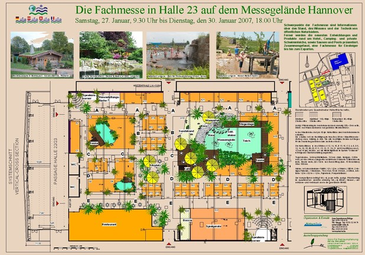
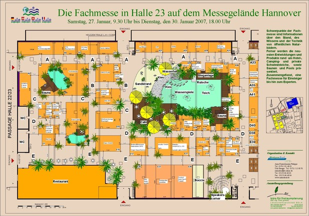
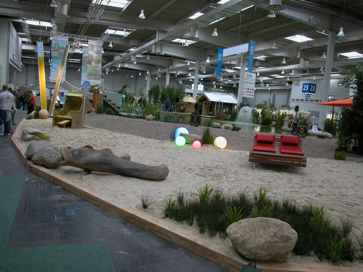
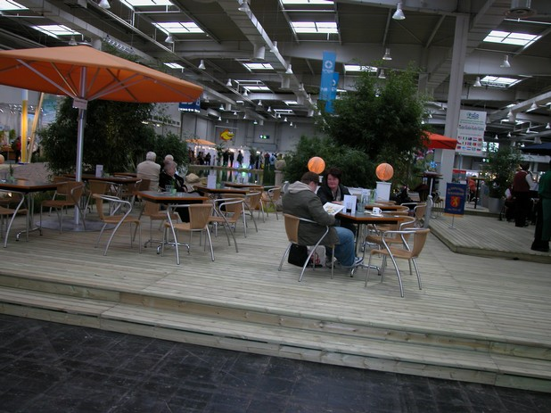
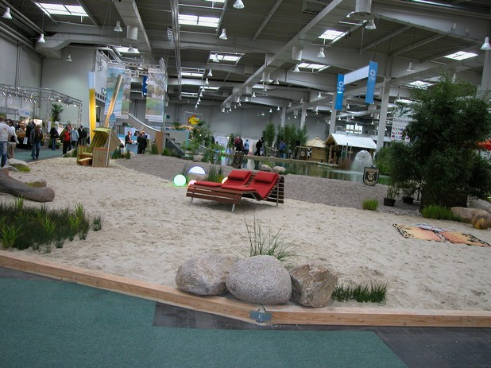
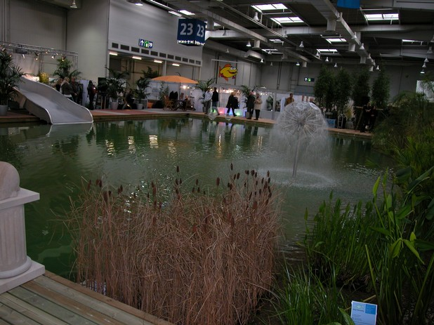
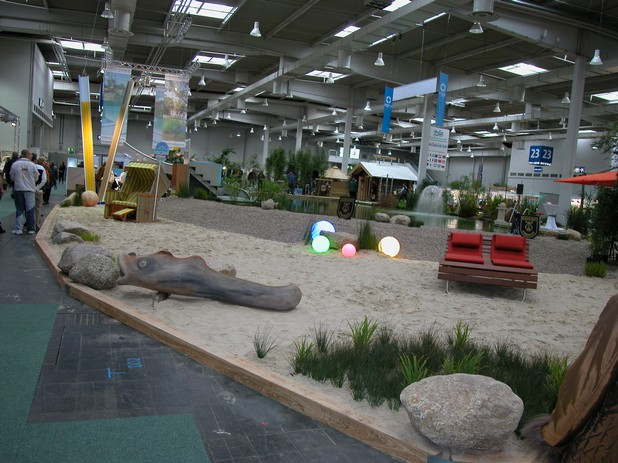
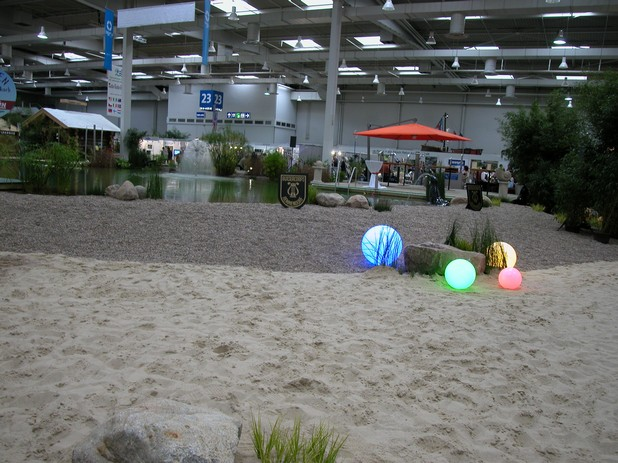

<Carousel>
<CarouselImage description="Entwurf Halle 23">

</CarouselImage>
<CarouselImage description="Standbesetzung Halle 23">

</CarouselImage>
<CarouselImage description="Sandstrand am Teich">

</CarouselImage>
<CarouselImage description="Café am Teich">

</CarouselImage>
<CarouselImage description="Liegen am Strand">

</CarouselImage>
<CarouselImage description="Lichteffekte am Teich">

</CarouselImage>
<CarouselImage description="Blick über die Gesamtanlage">

</CarouselImage>
<CarouselImage description="Holzterrassen am Teich">

</CarouselImage>
<CarouselImage description="Bunte Kugeln am Teich">

</CarouselImage>
</Carousel>

<SpecificationsTable title="ABF 2007 Hannover - technische Daten">
    {[
        ["Baujahr:", "2007"],
        ["Planungszeitraum:", "2006"],
        ["Gesamtfläche:", "1.000 m²"],
        ["Bauweise:", "1-Kammer-System"],
        ["Wasserfläche:", "Gesamtwasserfläche 350  m²"],
        ["Ausstattung:", "Holzterrassen aus Lärchenholz, 300 m² großer Sandstrand, Wasserspiele, Beleuchtung, Randbereiche mit Röhrrichtbepflanzung"],
    ]}
</SpecificationsTable>
