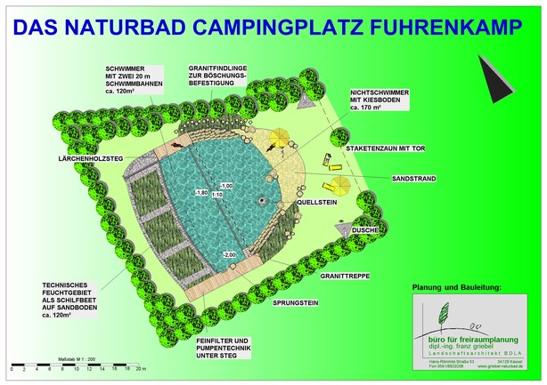
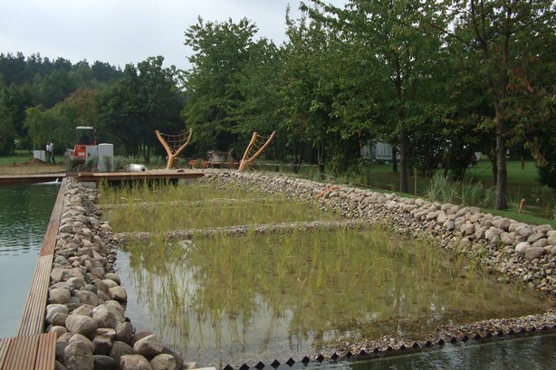
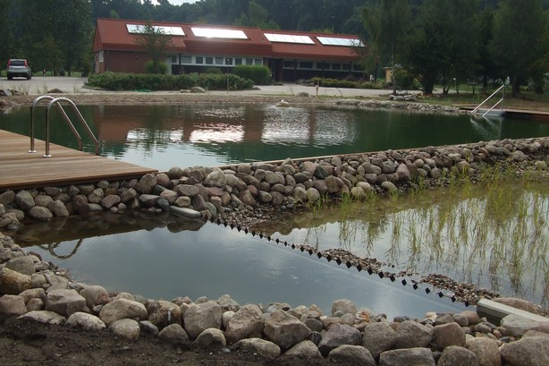
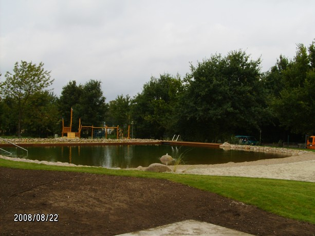

<Carousel>
<CarouselImage description="Entwurf">

</CarouselImage>
<CarouselImage description="Aufbereitungsbereich">

</CarouselImage>
<CarouselImage description="Gesamtanlage">

</CarouselImage>
<CarouselImage description="Schwimmbereich mit Sandstrand">

</CarouselImage>
</Carousel>

<SpecificationsTable title="Naturschwimmbad Campingplatz Fuhrenkamp Bergen an der Dumme - technische Daten">
    {[
        ["Baujahr:", "2007 bis 2008"],
        ["Planungszeitraum:", "Neubau, 2-Kammer-System"],
        ["Bauweise:", "kombiniertes Nichtschwimmer-/ Schwimmerbecken"],
        ["Badebecken:", "290 m²"],
        ["Nutzbare Wasserfläche:", "vollbiologisch über techn. Feuchtgebiet (Constructed Wetland) mit horizontaler Durchströmung"],
        ["Wasseraufbereitung:", "zwei 20-m-Schwimmbahnen, Sprungstein, Holzstegen aus Lärchenholz, Kiesstrand, Sandstrand, zwei Sprudelsteine im NS-Bereich, Dusche, Granittreppe"],
    ]}
</SpecificationsTable>
