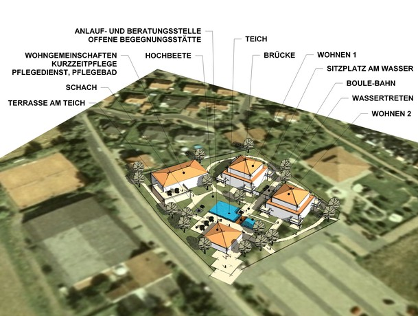
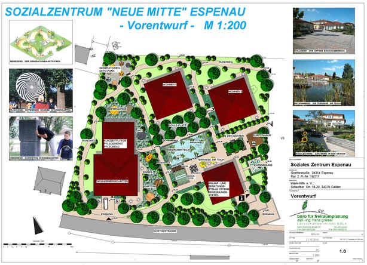
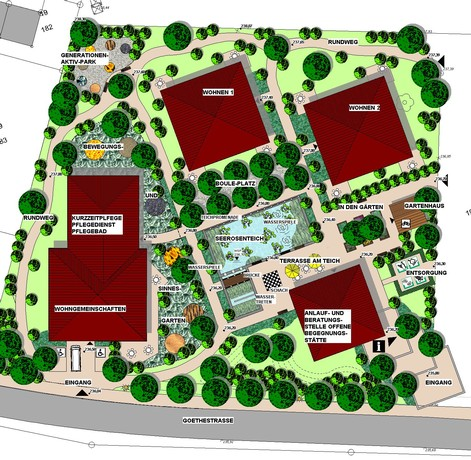

<Carousel>
<CarouselImage description="Vorkonzept">

</CarouselImage>
<CarouselImage description="Vorentwurf - Gesamtplan">

</CarouselImage>
<CarouselImage description="Vorentwurf">

</CarouselImage>
</Carousel>

<SpecificationsTable title="Wohnanlage Ahnatal - technische Daten">
    {[
        ["Planungszeitraum:", "2010"],
        ["Bauweise:", "Integrative Wohnanlage für betreutes Pflegewohnen für behinderte und ältere Menschen"],
        ["Ausstattung:", "barrierefreie Anlage mit Seerosenteich, Wasserspielen, Terrasse am Teich, Wassertreten, Sitzplätzen, Bouleplatz, Hochbeete zum Gärtnern, Ruhe- und Sitzmöglichkeiten im Park, Freischach, Generationen-Aktiv-Park, Bewegungs- und Sinnesgarten"],
    ]}
</SpecificationsTable>
