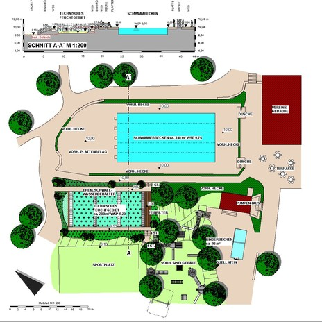
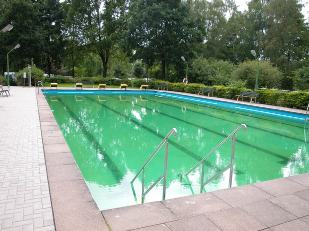
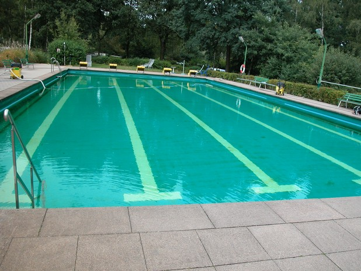
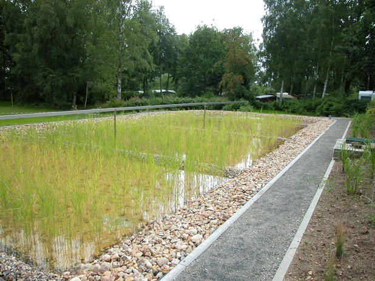
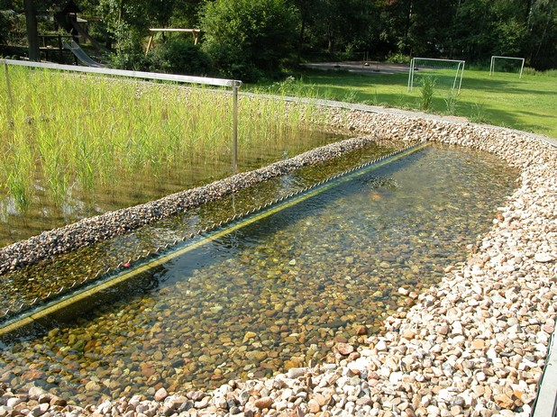

<Carousel>
<CarouselImage description="Entwurf">

</CarouselImage>
<CarouselImage description="Schwimmerbecken">

</CarouselImage>
<CarouselImage description="Schwimmerbecken mit neuer Folie">

</CarouselImage>
<CarouselImage description="Aufbereitung">

</CarouselImage>
<CarouselImage description="Zulauf Schilfbeet">

</CarouselImage>
</Carousel>

<SpecificationsTable title="Naturschwimmbad BffL Braunschweig - technische Daten">
    {[
        ["Baujahr:", "200"],
        ["Planungszeitraum:", "2003"],
        ["Bauweise:", "Umbau, 2-Kammer-System"],
        ["Badebecken:", "kombiniertes Nichtschwimmer-/ Schwimmerbecken, separates Kinderbecken"],
        ["Wasseraufbereitung:", "330 m²"],
        ["Ausstattung:", "vollbiologisch über techn. Feuchtgebiet (Constructed Wetland) mit horizontaler Durchströmung"],
    ]}
</SpecificationsTable>
