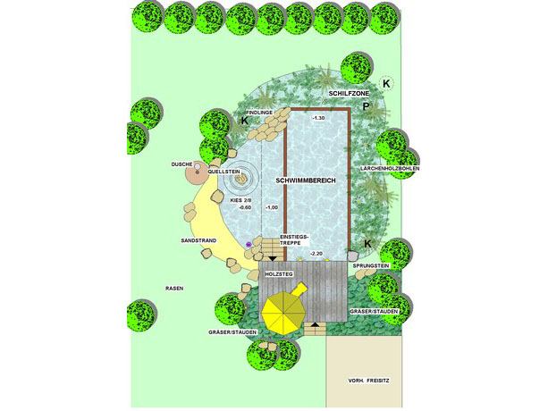
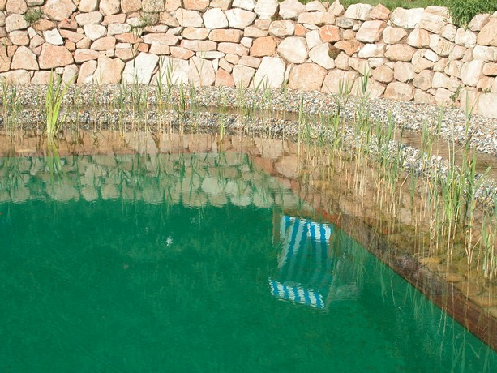
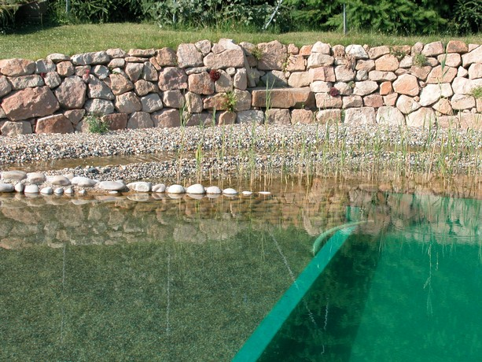
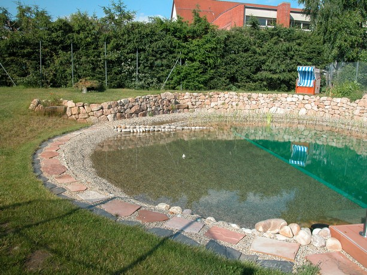
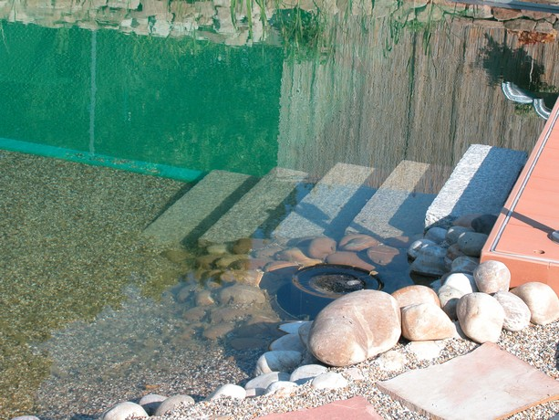
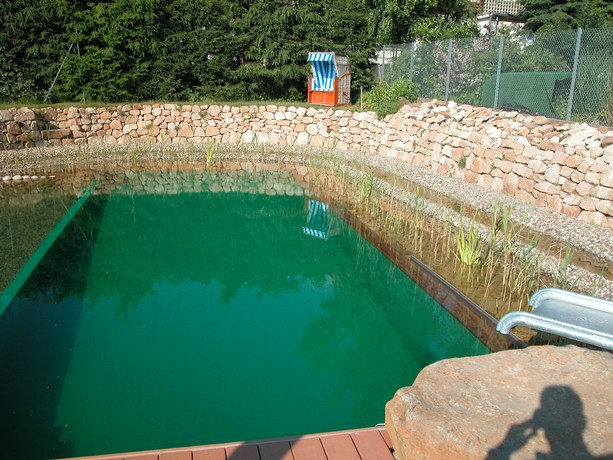
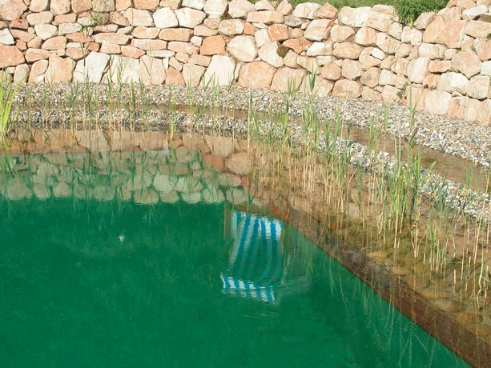

<Carousel>
<CarouselImage description="Entwurf">

</CarouselImage>
<CarouselImage description="Schwimmer mit Schilfzone">

</CarouselImage>
<CarouselImage description="Schwimmer/Nichtschwimmer">

</CarouselImage>
<CarouselImage description="Einlauf ins Schilfbeet">

</CarouselImage>
<CarouselImage description="Gesamtanlage">

</CarouselImage>
<CarouselImage description="Nichtschwimmer mit Kiesstrand">

</CarouselImage>
<CarouselImage description="Granittreppe">

</CarouselImage>
<CarouselImage description="Nichtschwimmer">

</CarouselImage>
<CarouselImage description="Schwimmer mit Aufbereitung">

</CarouselImage>
<CarouselImage description="Schwimmer mit Schilfzone">

</CarouselImage>
</Carousel>

<SpecificationsTable title="Schwimmteich Fam. Wiegel in Ahlheim-Heinebach - technische Daten">
    {[
        ["Baujahr:", "2009"],
        ["Planungszeitraum:", "2009"],
        ["Bauweise:", "Neubau, 1-Kammer-System"],
        ["Badebecken:", "kombiniertes Nichtschwimmer-/ Schwimmerbecken"],
        ["Wasseraufbereitung:", "70 m², vollbiologisch über techn. Feuchtgebiet (Constructed Wetland) mit horizontaler Durchströmung"],
        ["Ausstattung:", "Sprungstein, Granittreppe, Holzsteg aus Lärchenholz, Sandstrand, Sprudelstein "],
    ]}
</SpecificationsTable>
