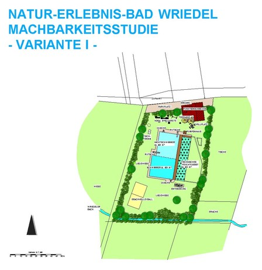

<SpecificationsTable title="Naturbad Wriedel - Vorkonzept - technische Daten">
    {[
        ["Planungszeitraum:", "2003"],
        ["Gesamtfläche:", "0,8 ha"],
        ["Bauweise:", "Umbau, 2-Kammer-System"],
        ["Badebecken:", "kombiniertes Nichtschwimmer-/ Schwimmerbecken"],
        ["Wasseraufbereitung:", "960 m²"],
        ["Ausstattung Variante I:", "vollbiologisch über techn. Feuchtgebiet (Constructed Wetland) mit horizontaler Durchströmung"],
    ]}
</SpecificationsTable>
