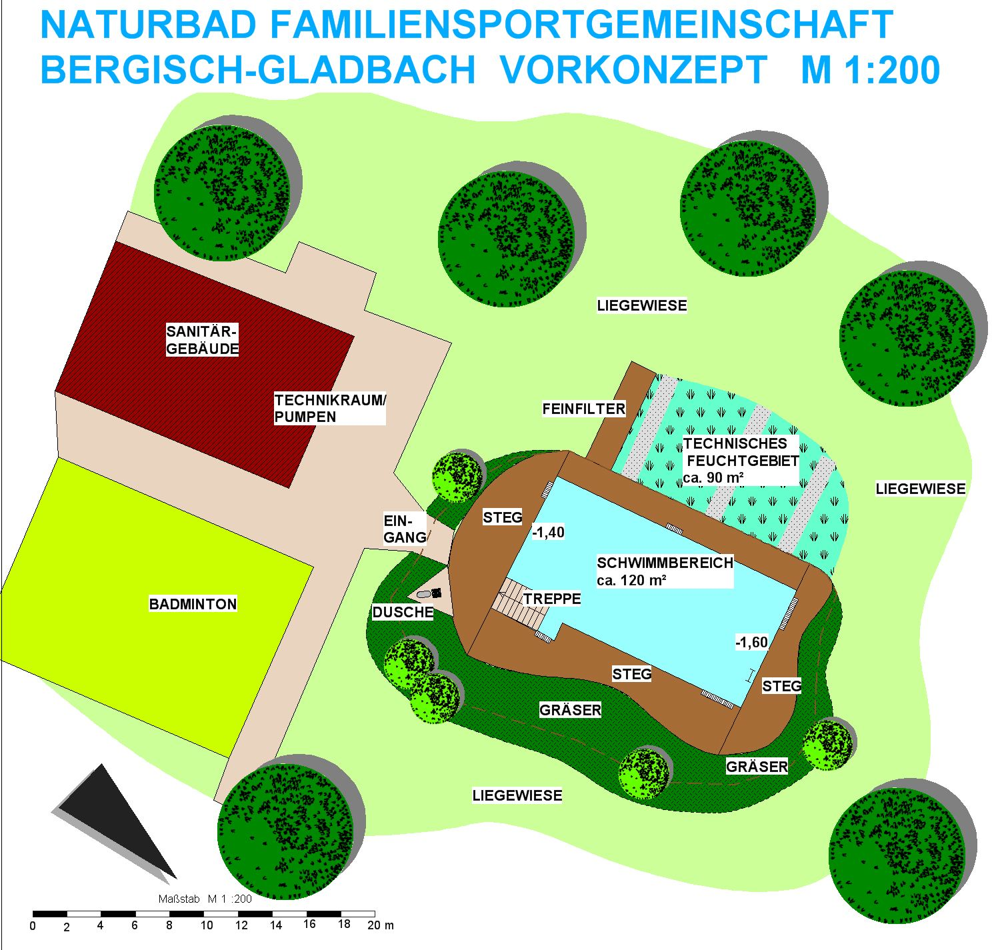

<SpecificationsTable title="Vorkonzept - technische Daten">
    {[
        ["Planungszeitraum", "2005"],
        ["Bauweise:", "Umbau, 2-Kammer-System"],
        ["Badebecken:", "Schwimmerbecken"],
        ["Nutzbare Wasserfläche:", "120 m²"],
        ["Wasseraufbereitung:", "vollbiologisch über techn. Feuchtgebiet (Constructed Wetland) mit horizontaler Durchströmung"],
        ["Ausstattung:", "Holzstege aus Lärchenholz, Schwimmbereich mit Zugang über Granittreppe, Dusche, Eingrünung"],
    ]}
</SpecificationsTable>

