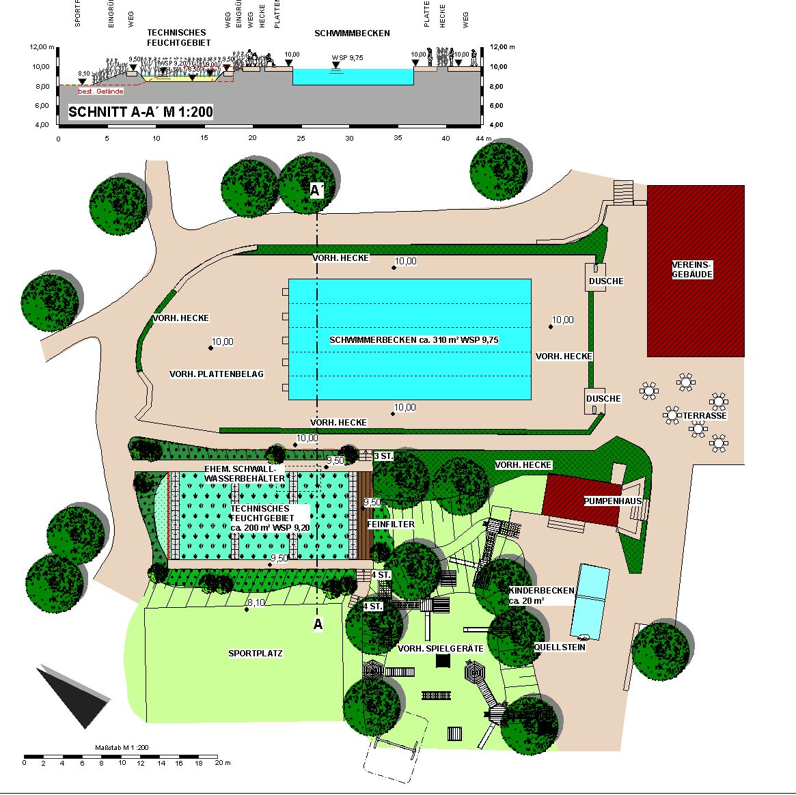
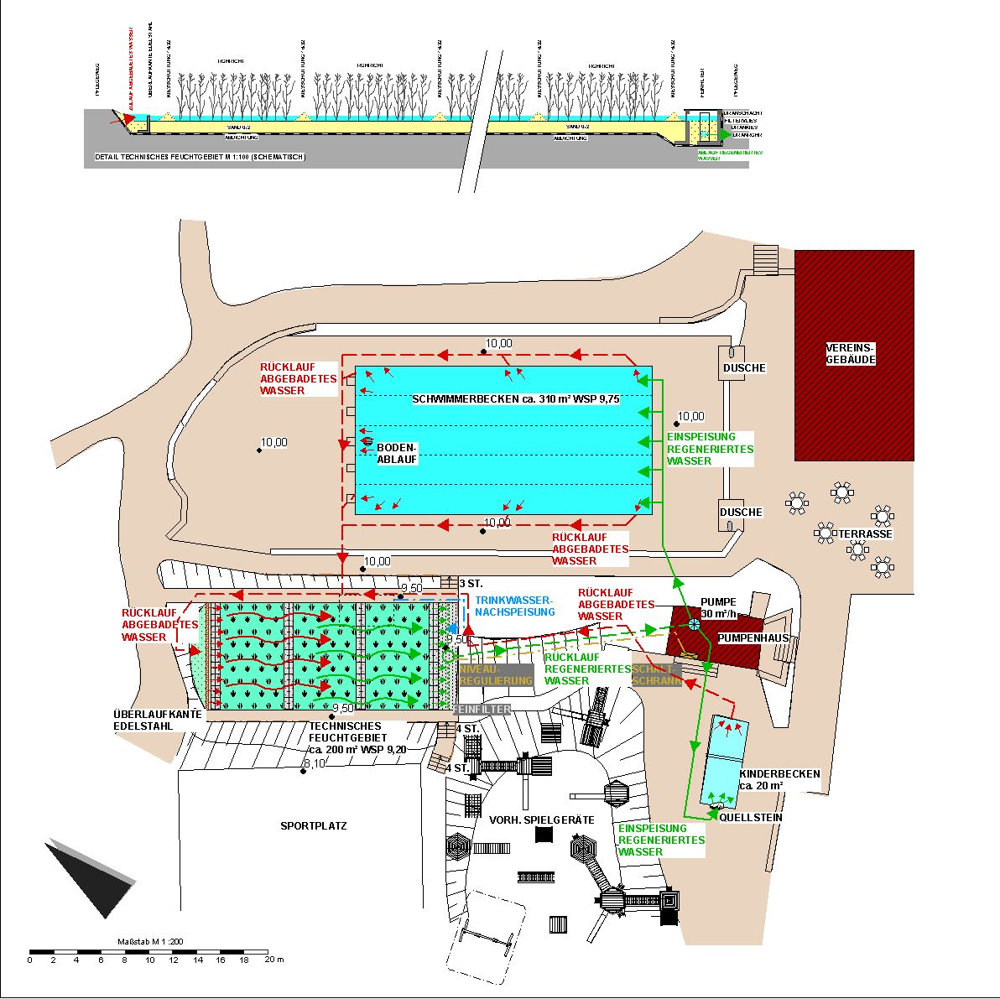

<SpecificationsTable title="Technische Daten">
    {[
        ["Baujahr:", "2004"],
        ["Planungszeitraum:", "2003"],
        ["Bauweise:", "Umbau, 2-Kammer-System"],
        ["Badebecken:", "kombiniertes Nichtschwimmer-/ Schwimmerbecken, separates Kinderbecken"],
        ["Nutzbare Wasserfläche:", "330 m², Schwimmerbereich: 310 m², Kinderbecken: 20 m²"],
        ["Wasseraufbereitung:", "vollbiologisch über techn. Feuchtgebiet (Constructed Wetland) mit horizontaler Durchströmung"],
        ["Wasseraufbereitung:", "vier 25-m-Schwimmbahnen, Kinderbecken mit Sprudelstein"],
    ]}
</SpecificationsTable>

## Entwurf

## Wasserkreislauf
