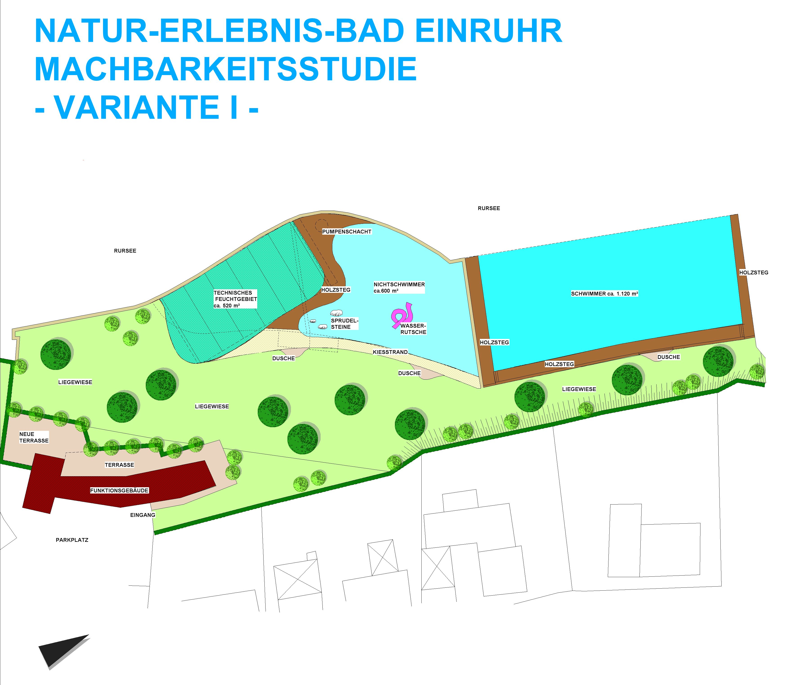
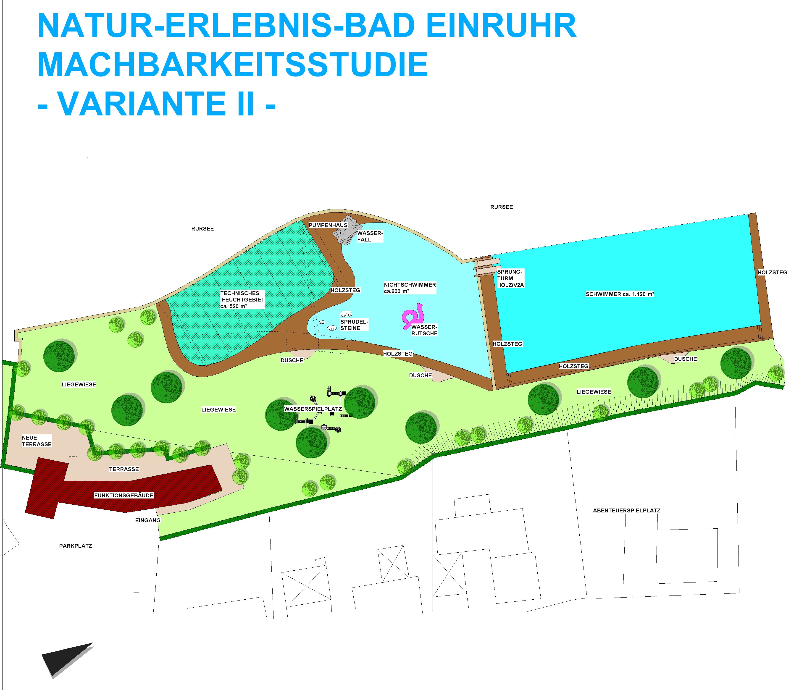

<SpecificationsTable title="Technische Daten">
    {[
        ["Planungszeitraum:", "2002"],
        ["Gesamtfläche:", "0,5 ha"],
        ["Bauweise:", "Umbau, 2-Kammer-System"],
        ["Badebecken:", "Nichtschwimmer-/Kinderbecken, Schwimmerbereich im Rursee"],
        ["Nutzbare Wasserfläche:", "600 m²"],
        ["Wasseraufbereitung:", "vollbiologisch über technisches Feuchtgebiet (Constructed Wetland) mit horizontaler Durchströmung"],
        ["Ausstattung Var. I:", "Kiesstrand, Bekiesung Nichtschwimmerbereich, drei Sprudelsteine im NS-Bereich, Steganlagen um die Becken"],
        ["Zusätzl. Ausstattung Var. II:", "Steganlage aus Lärchenholz, Sprunganlage mit 1/3-m-Plattform, Wasserfall, Wasserspielplatz"],
    ]}
</SpecificationsTable>

## Machbarkeitsstudie Var I

## Machbarkeitsstudie Var 2
