<Carousel>
<CarouselImage description="Nichtschwimmer und Kinderbecken, Rursee">

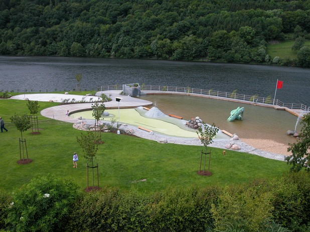

</CarouselImage>
<CarouselImage description="Nichtschwimmer und Kinderbecken, Rursee">

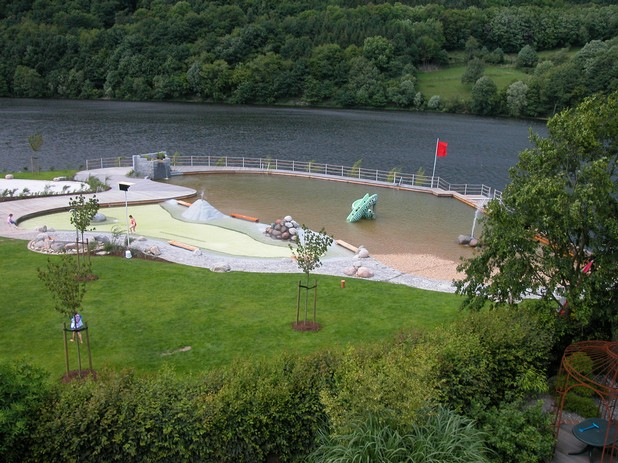

</CarouselImage>
<CarouselImage description="Aufbereitung">

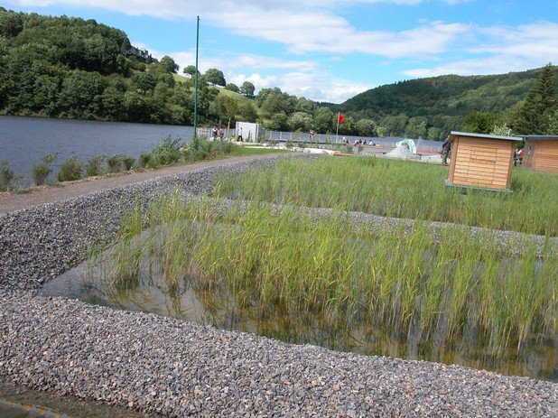

</CarouselImage>
<CarouselImage description="Spielbereich, Holzsteg">

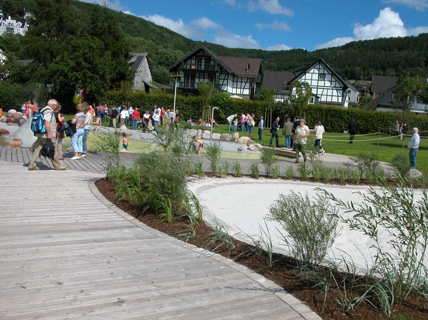

</CarouselImage>
<CarouselImage description="Entwurf">

</CarouselImage>
<CarouselImage description="Holzsteg um das Kinderbecken">

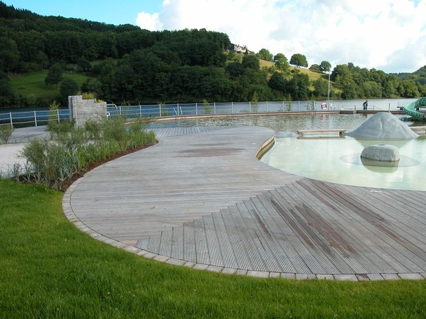

</CarouselImage>
<CarouselImage description="Aussendusche">

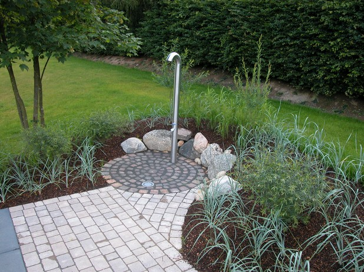

</CarouselImage>
<CarouselImage description="Kinderbecken mit Sprudelstein">

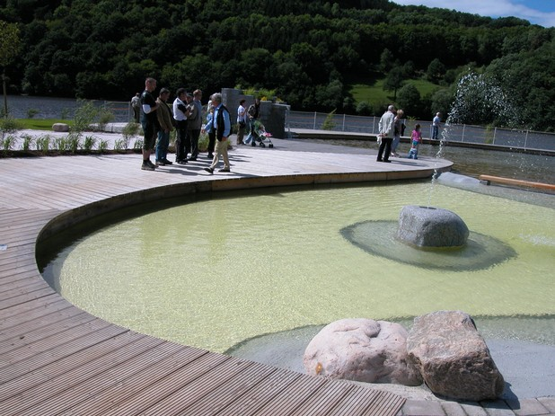

</CarouselImage>
<CarouselImage description="Aufbereitung">

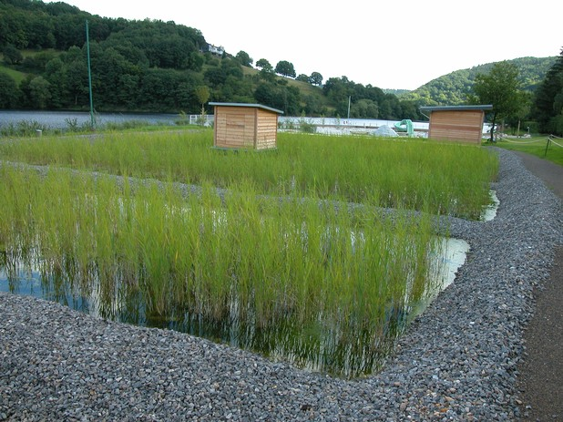

</CarouselImage>
<CarouselImage description="Kinderbecken und Nichtschwimmer">

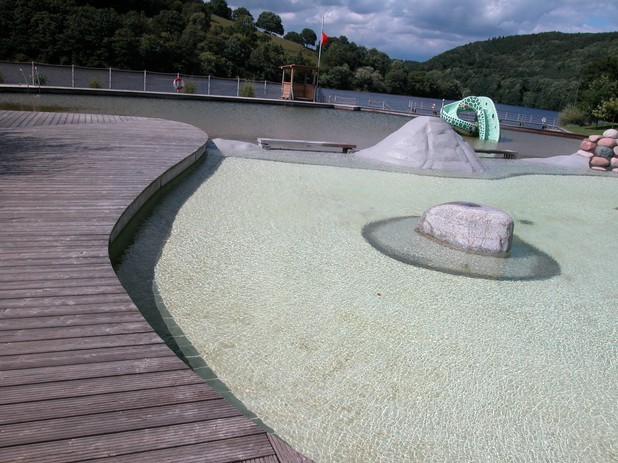

</CarouselImage>
<CarouselImage description="Wasserfall am Nichtschwimmer">

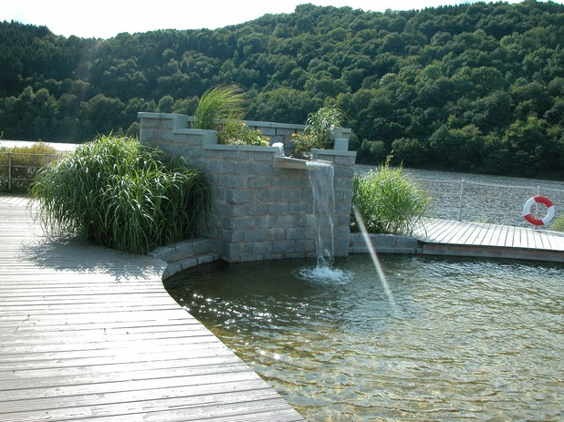

</CarouselImage>
<CarouselImage description="Schwimmbereich im Rursee">

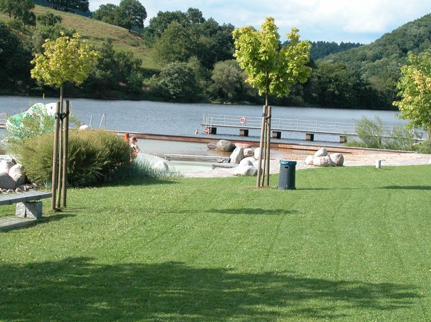

</CarouselImage>
<CarouselImage description="Kinderbecken">

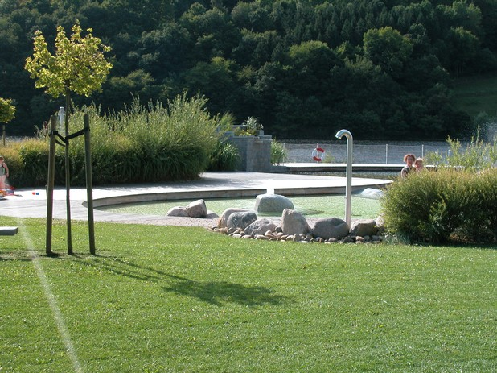

</CarouselImage>
<CarouselImage description="Naturbad am Rursee">

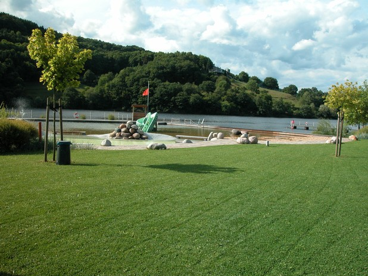

</CarouselImage>
<CarouselImage description="Schwimmbereich im Rursee">

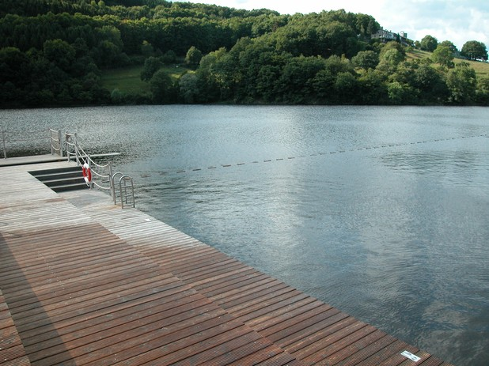

</CarouselImage>
<CarouselImage description="Nichtschwimmer und Kinderbecken">

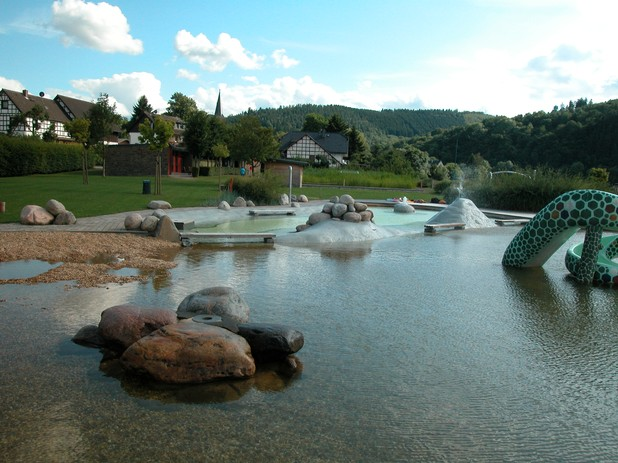

</CarouselImage>
<CarouselImage description="Nichtschwimmer mit Wasserfall">

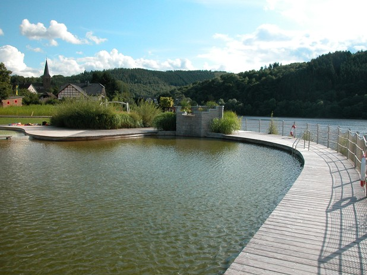

</CarouselImage>
<CarouselImage description="Kinderbecken mit Holzsteg">

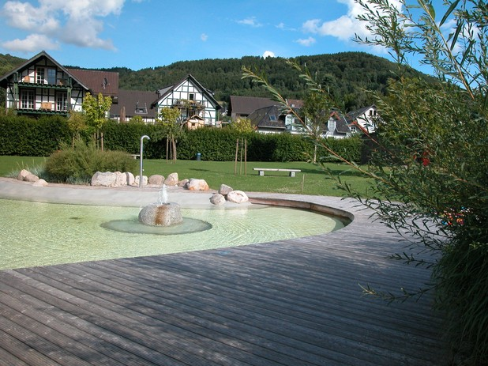

</CarouselImage>
<CarouselImage description="Aufbereitung">

</CarouselImage>
</Carousel>

<SpecificationsTable title="Technische Daten">
    {[
        ["Baujahr:", "2006/2007"],
        ["Planungszeitraum:", "2004 bis 2005"],
        ["Gesamtfläche:", "0,5 ha"],
        ["Bauweise:", "Umbau, 2-Kammer-System"],
        ["Badebecken:", "Nichtschwimmerbecken, separates Kinderbecken, Schwimmerbereich im Rursee"],
        ["Nutzbare Wasserfläche:", "560 m²"],
        ["Wasseraufbereitung:", "vollbiologisch über technisches Feuchtgebiet (Constructed Wetland) mit horizontaler Durchströmung"],
        ["Ausstattung:", "Holzstege aus Lärchenholz um den Nichtschwimmerbereich, großer Kiesstrand, Geysir im NS-Bereich, Wasserfall, Rutsche im Nichtschwimmerbereich, Kinderbecken mit Quellhügel, Sprudelstein, Sprühschlange und Kleinkindrutsche, Wasserpielplatz, Boccia, Beachvolleyball."],
    ]}
</SpecificationsTable>
