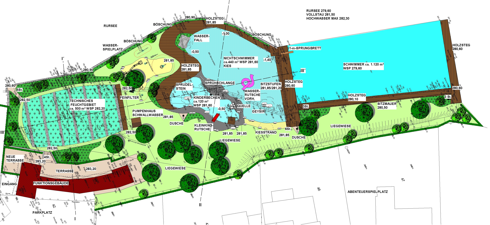
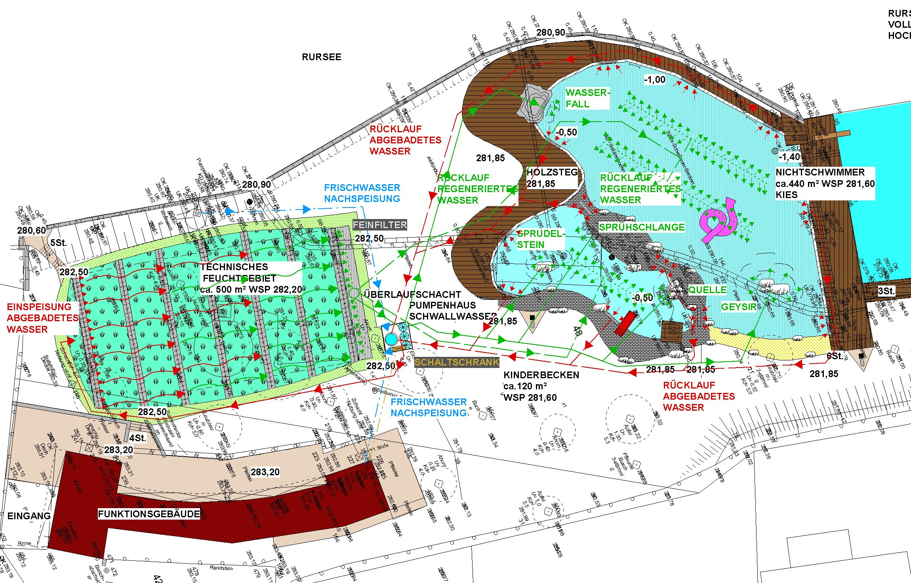

<SpecificationsTable title="Technische Daten">
    {[
        ["Baujahr:", "2006/2007"],
        ["Planungszeitraum:", "2004 bis 2005"],
        ["Gesamtfläche:", "0,5 ha"],
        ["Bauweise:", "Umbau, 2-Kammer-System"],
        ["Badebecken:", "Nichtschwimmerbecken, separates Kinderbecken Schwimmerbereich im Rursee"],
        ["Nutzbare Wasserfläche:", "560 m²"],
        ["Wasseraufbereitung:", "vollbiologisch über technisches Feuchtgebiet (Constructed Wetland) mit horizontaler Durchströmung"],
        ["Ausstattung:", "Holzstegen aus Lärchenholz um den NS-Bereich, großer Kiesstrand, Geysier im NS-Bereich, Wasserfall, Rutsche im Nichtschwimmerbereich, Kinderbecken mit Quellhügel, Sprudelstein, Sprühschlange und Kleinkindrutsche, Wasserpielplatz, Boccia, Beachvolleyball"]
    ]}
</SpecificationsTable>

## Entwurf

## Wasserkreislauf
