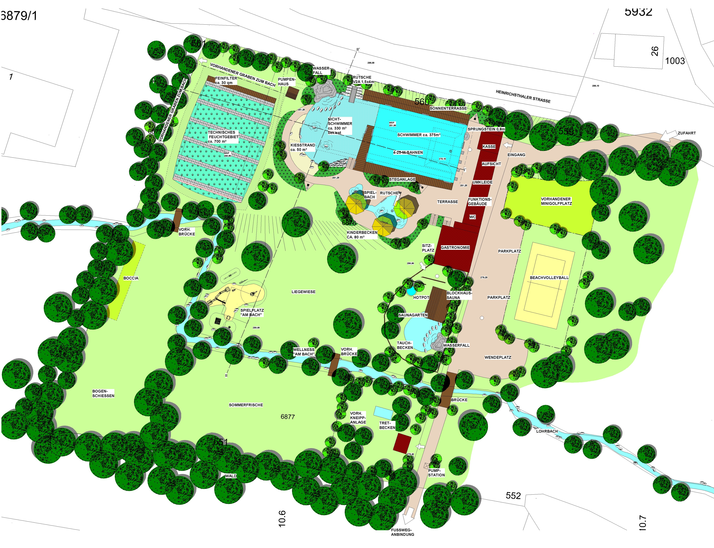
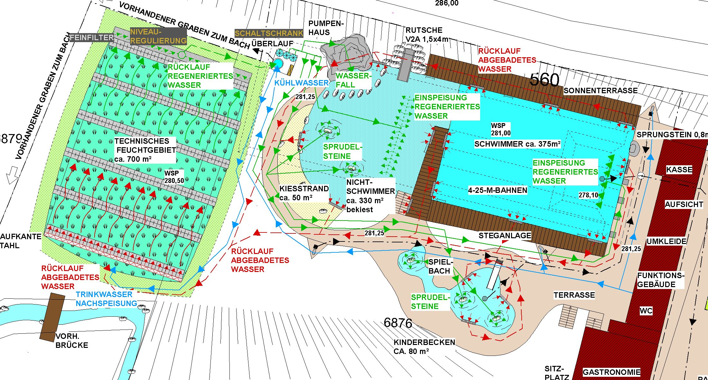

<SpecificationsTable title="Technische Daten">
    {[
        ["Baujahr:", "2008/2009"],
        ["Planungszeitraum:", "2006 bis 2008"],
        ["Gesamtfläche:", "1 ha"],
        ["Bauweise:", "Umbau, 2-Kammer-System"],
        ["Badebecken:", "kombiniertes Nichtschwimmer-/ Schwimmerbecken mit integriertem Sprungbereich, separates Kinderbecken"],
        ["Nutzbare Wasserfläche:", "785 m²"],
        ["Wasseraufbereitung:", "vollbiologisch über techn. Feuchtgebiet (Constructed Wetland) mit horizontaler Durchströmung"],
        ["Ausstattung:", "vier 25-m-Schwimmbahnen, Sprungstein mit, Holzstege aus Lärchenholz, Sonnenterrasse, Kiesstrand, Sprudelsteine im NS-Bereich, Wasserfall, Kinderbecken mit Bachlauf, Sprudelsteinen, Sprühschlange und Kleinkindrutsche, Spielplatz am Bach, Beachvolleyball."],
    ]}
</SpecificationsTable>

## Entwurf

## Wasserkreislauf

