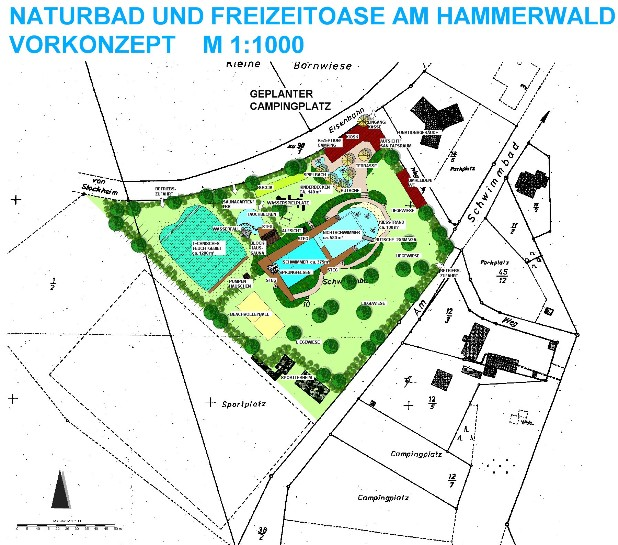

<SpecificationsTable title="Naturbad Hirzenhain - Vorkonzept - technische Daten">
    {[
        ["Planungszeitraum:", "2005"],
        ["Gesamtfläche:", "1,35 ha"],
        ["Bauweise:", "Umbau, 2-Kammer-System"],
        ["Badebecken:", "kombiniertes Nichtschwimmer-/ Schwimmerbecken mit integriertem Sprungbereich, separates Kinderbecken"],
        ["Nutzbare Wasserfläche:", "1.100 m²"],
        ["Wasseraufbereitung:", "vollbiologisch über techn. Feuchtgebiet (Constructed Wetland) mit horizontaler Durchströmung"],
        ["Ausstattung:", "vier 25-m-Schwimmbahnen, Sprungfelsen mit 1/3-m-Plattform, Holzstegen aus Lärchenholz Kiesstrand, drei Sprudelsteine im NS-Bereich, Breitrutsche, Kinderbecken mit Bachlauf, Sprudelsteinen und Kleinkindrutsche, Wasserspielplatz, Boccia, Beachvolleyball, Tischtennis, opt. Saunagarten mit Blockhaussauna, Tauchbecken, Wasserfall."],
    ]}
</SpecificationsTable>
