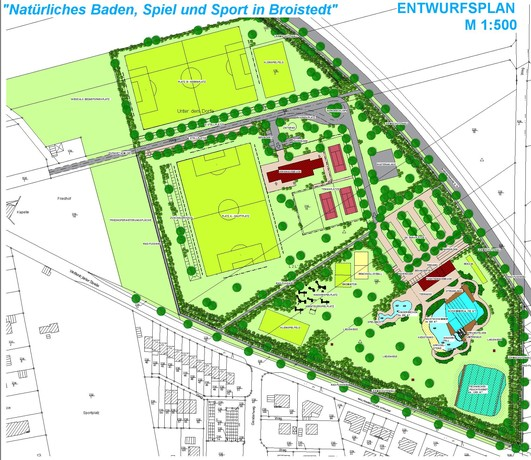
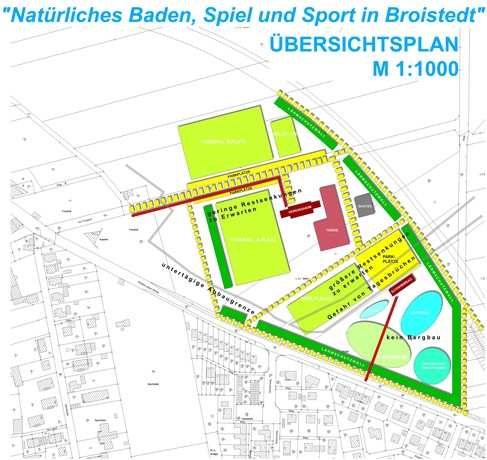
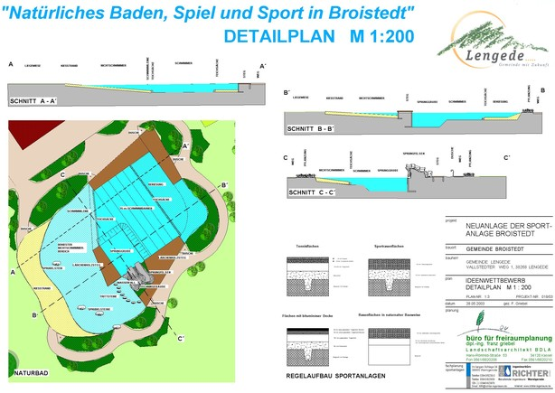

<Carousel>
<CarouselImage description="Gesamtentwurf">

</CarouselImage>
<CarouselImage description="Funktionsplan">

</CarouselImage>
<CarouselImage description="Detail Naturbad">

</CarouselImage>
</Carousel>

<SpecificationsTable title="Naturbad Lengede - Wettbewerb - technische Daten">
    {[
        ["Planungszeitraum:", "2003"],
        ["Gesamtfläche:", "2,5 ha"],
        ["Bauweise:", "Neubau, 2-Kammer-System"],
        ["Badebecken:", "kombiniertes Nichtschwimmer-/Schwimmerbecken mit separatem Kinderbecken"],
        ["Nutzbare Wasserfläche:", "1.650 m²"],
        ["Wasseraufbereitung:", "vollbiologisch über techn. Feuchtgebiet (Constructed Wetland) mit horizontaler Durchströmung"],
        ["Ausstattung:", "vier 25-m-Schwimmbahnen, Sprungfelsen mit 1/3-m-Plattform, 250 m² Holzstegen aus Lärchenholz, 200 m² großer Kiesstrand, drei Sprudelsteine im NS-Bereich, Wasserfall, Kinderbecken mit Bachlauf, vier Sprudel-steinen, Sprühschlange und Kleinkindrutsche, Wasser- und Abenteuerspielplatz, Beachvolleyball, Boccia, Badminton, Bolzplatz"],
    ]}
</SpecificationsTable>
