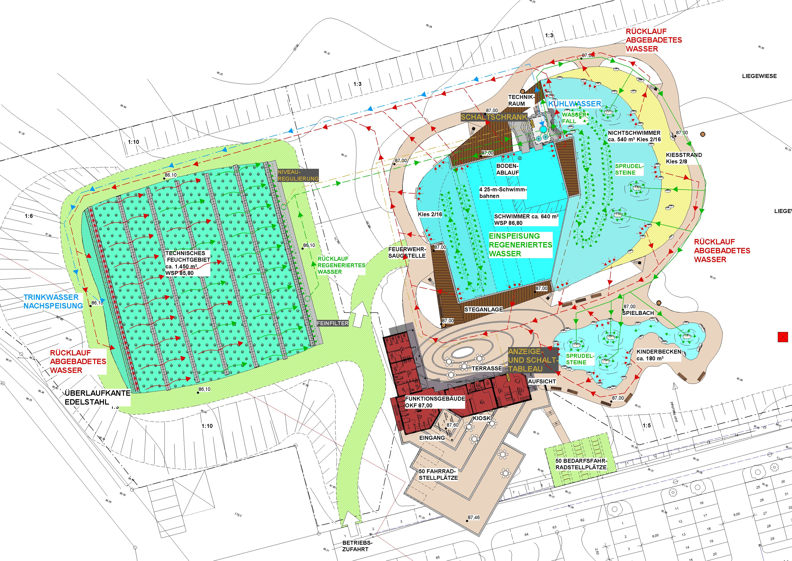

<SpecificationsTable title="Technische Daten">
    {[
        ["Planungszeitraum:", "2003/2004"],
        ["Baujahr:", "2004/2005"],
        ["Gesamtfläche:", "2,1 ha"],
        ["Bauweise:", "Neubau, 2-Kammer-System"],
        ["Badebecken:", "kombiniertes Nichtschwimmer-/ Schwimmerbecken mit integriertem Sprungbereich, separates Kinderbecken"],
        ["Nutzbare Wasserfläche:", "1.500 m²"],
        ["Wasseraufbereitung:", "vollbiologisch über techn. Feuchtgebiet (Constructed Wetland) mit horizontaler Durchströmung"],
        ["Ausstattung:", "vier 25-m-Schwimmbahnen, Sprungfelsen mit 1/3-m-Plattform, 250 m² Holzstegen aus Lärchenholz, 200 m² großer Kiesstrand, drei Sprudelsteine im NS-Bereich, Wasserfall, Kinderbecken mit Bachlauf, vier Sprudel-steinen, Sprühschlange und Kleinkindrutsche, Wasser- und Abenteuerspielplatz, Beachvolleyball, Boccia, Badminton, Bolzplatz, Freischach"],
    ]}
</SpecificationsTable>

## Entwurf

## Wasserkreislauf
