<Carousel>
<CarouselImage description="Nichtschwimmer und Sandstrand">

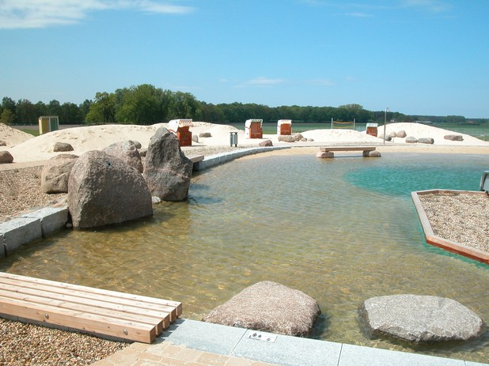

</CarouselImage>
<CarouselImage description="Schwimmer mit Sprungturm">

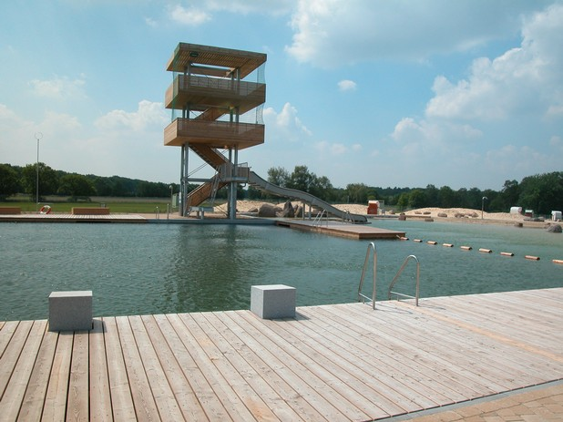

</CarouselImage>
<CarouselImage description="Schwimmer und Pumpenhaus">

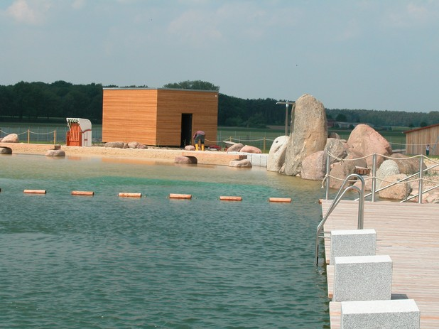

</CarouselImage>
<CarouselImage description="Insel zwischen Schwimmer und Nichtschwimmer">

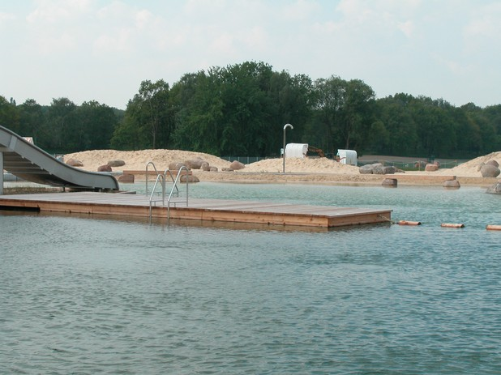

</CarouselImage>
<CarouselImage description="Schwimmer mit Massagestation">

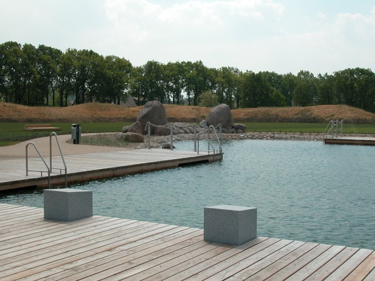

</CarouselImage>
<CarouselImage description="Nichtschwimmer mit Sandstrand">

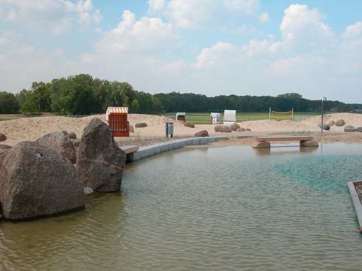

</CarouselImage>
<CarouselImage description="Schwimmer mit Holzsteg">

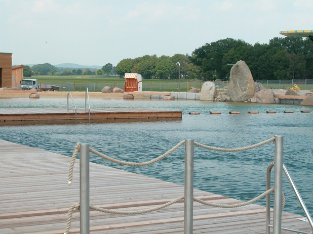

</CarouselImage>
<CarouselImage description="Wasserspiele im Nichtschwimmer">

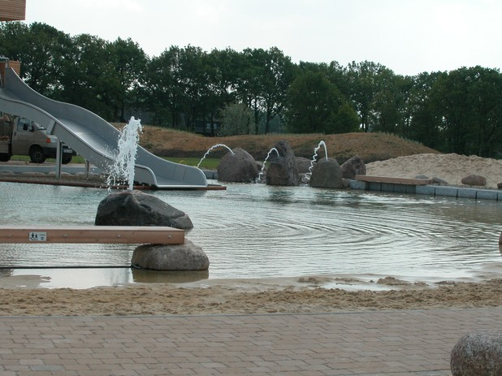

</CarouselImage>
<CarouselImage description="Wasserspiele im Nichtschwimmer">

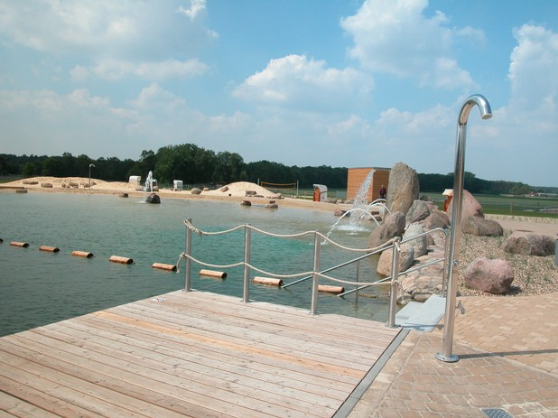

</CarouselImage>
<CarouselImage description="Nichtschwimmer mit Sandstrand">

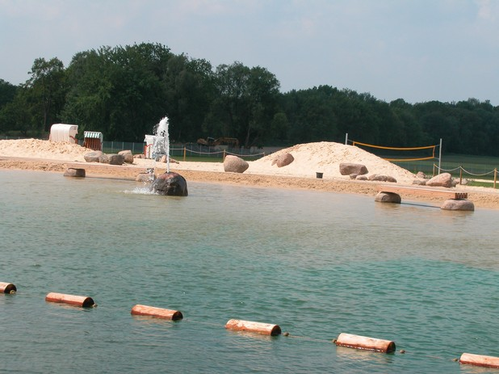

</CarouselImage>
<CarouselImage description="Schwimmerbereich">

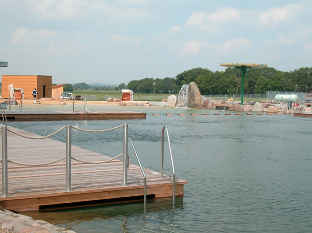

</CarouselImage>
<CarouselImage description="Schwimmer und Funktionsgebäude">

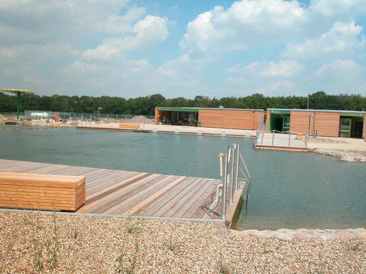

</CarouselImage>
<CarouselImage description="Funktionsgebäude">

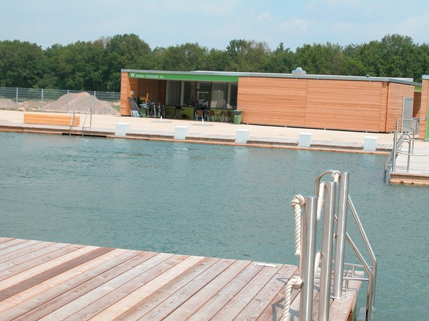

</CarouselImage>
<CarouselImage description="Wasserspeier im Nichtschwimmer">

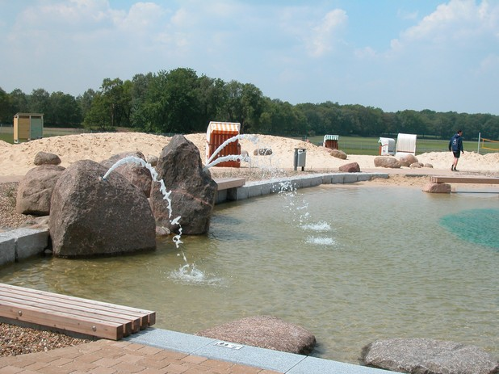

</CarouselImage>
<CarouselImage description="Wasserspiele">

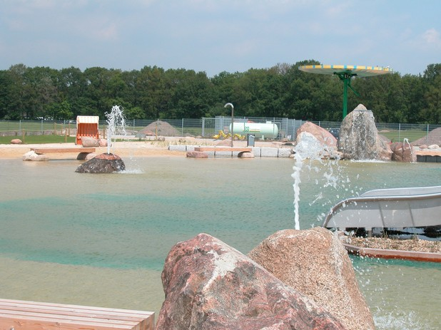

</CarouselImage>
<CarouselImage description="Wasserspeier und Schwalldusche">

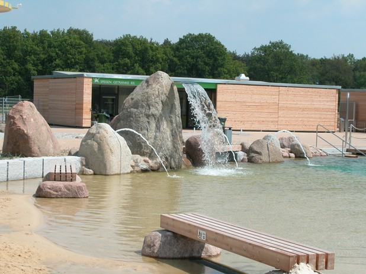

</CarouselImage>
<CarouselImage description="Wasserspeier und Schwalldusche">

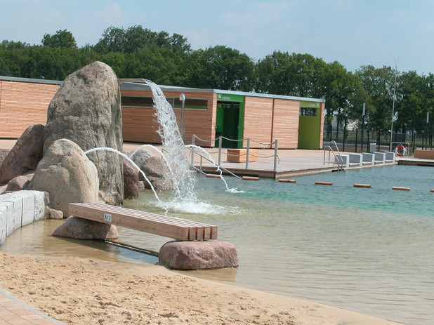

</CarouselImage>
<CarouselImage description="Entwurf">

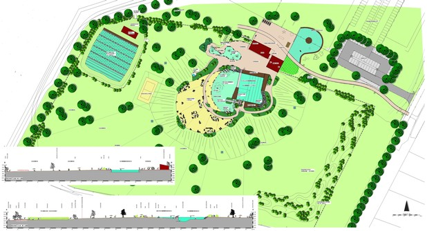

</CarouselImage>
<CarouselImage description="Schwimmer mit Sprungturm">

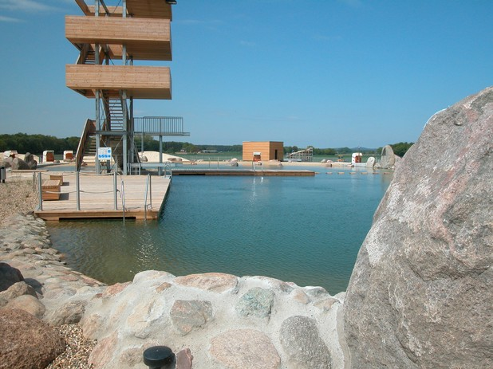

</CarouselImage>
<CarouselImage description="25-m-Schwimmbahnen">

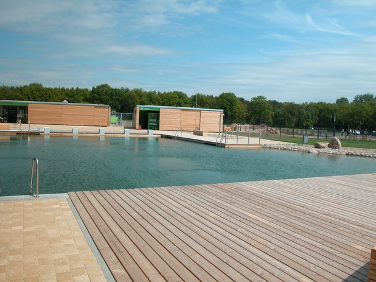

</CarouselImage>
<CarouselImage description="Nichtschwimmer mit Sandstrand">

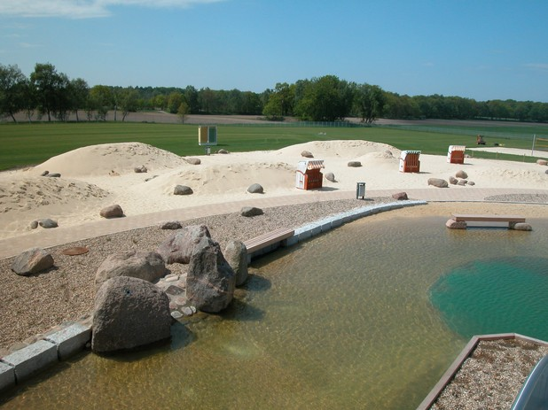

</CarouselImage>
<CarouselImage description="Breitrutsche ins Nichtschwimmer und Sandstrand">

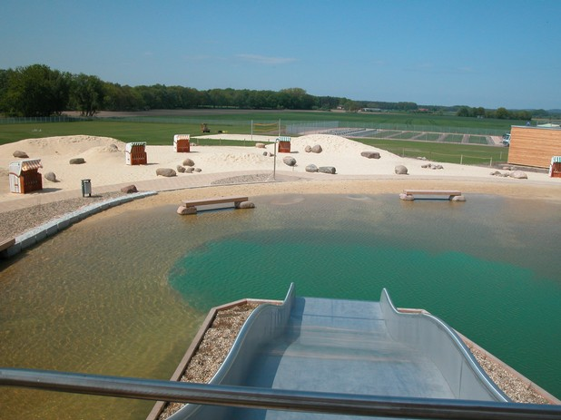

</CarouselImage>
<CarouselImage description="Nichtschwimmer mit Sandstrand">

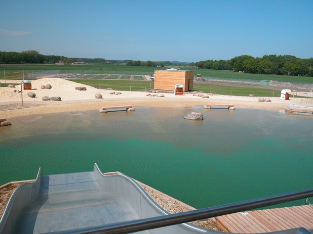

</CarouselImage>
<CarouselImage description="Nichtschwimmer und Kinderbecken">

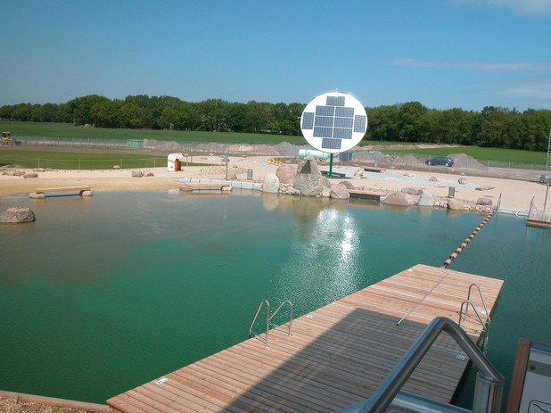

</CarouselImage>
<CarouselImage description="Massagestation im Schwimmerbecken ">

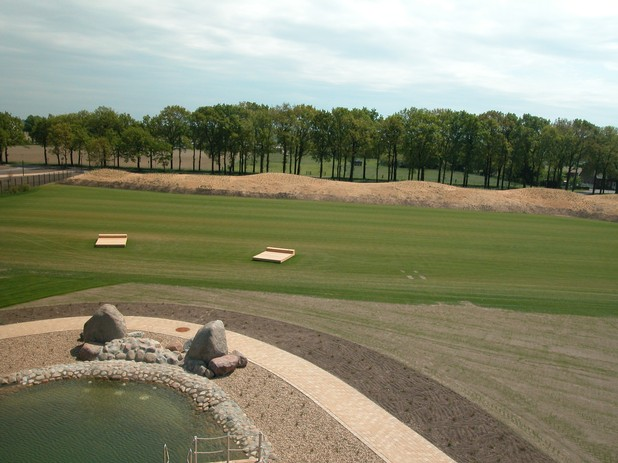

</CarouselImage>
<CarouselImage description="Nichtschwimmer mit Sandstrand und Aufbereitung">

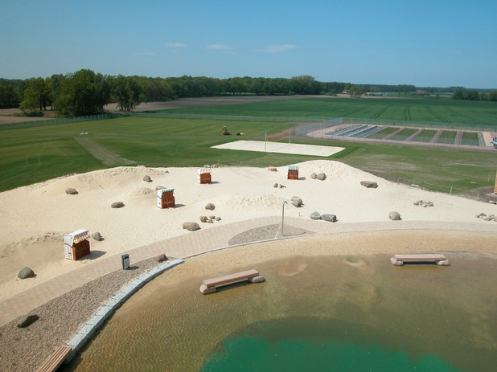

</CarouselImage>
<CarouselImage description="Trittsteine zur Insel und Breitrutsche">

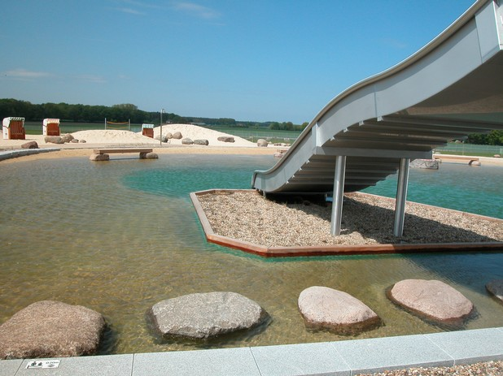

</CarouselImage>
<CarouselImage description="Sandstrand">

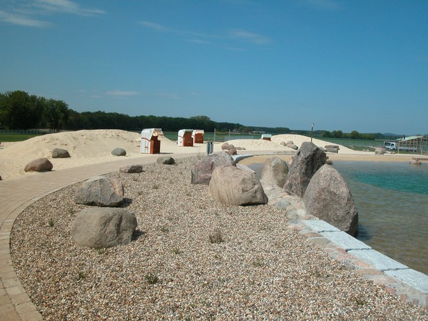

</CarouselImage>
<CarouselImage description="Sandstrand mit Strandkörben">

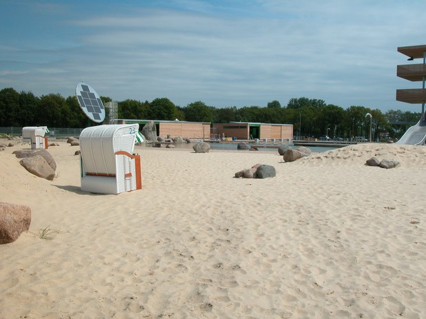

</CarouselImage>
<CarouselImage description="Aufbereitungsbereich">

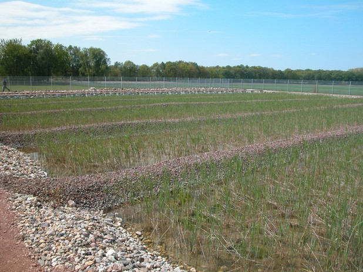

</CarouselImage>
</Carousel>

<SpecificationsTable title="Naturbad Olfen - technische Daten">
    {[
        ["Baujahr:", "2009/2010"],
        ["Planungszeitraum:", "2004 bis 2008"],
        ["Gesamtfläche:", "4,6 ha"],
        ["Bauweise:", "Neubau, 2-Kammer-System"],
        ["Badebecken:", "kombiniertes Nichtschwimmer-/ Schwimmerbecken mit integriertem Sprungbereich, separates Kinderbecken"],
        ["Nutzbare Wasserfläche:", "1.580 m²"],
        ["Wasseraufbereitung:", "vollbiologisch über technisches Feuchtgebiet (Constructed Wetland) mit horizontaler Durchströmung"],
        ["Ausstattung:", "fünf 25-m-Schwimmbahnen, Sprungturm mit 1/3-m-Plattform, 250 m² Holzstegen aus Lärchenholz, Massagestation, 1000 m² großer Sandstrand, Breitrutsche, Wasserspeier, Geysier, Schwalldusche im NS-Bereich, Badeinsel mit Zugang über Trittsteine, Kinderbecken mit Bachlauf, drei Sprudelsteinen, Sprühschlange und Kleinkindrutsche, Wasserspielplatz, Beachvolleyball."],
    ]}
</SpecificationsTable>
