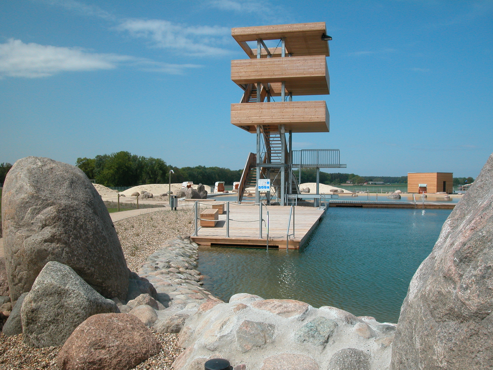
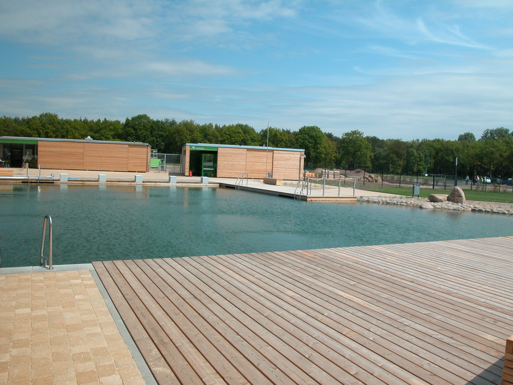
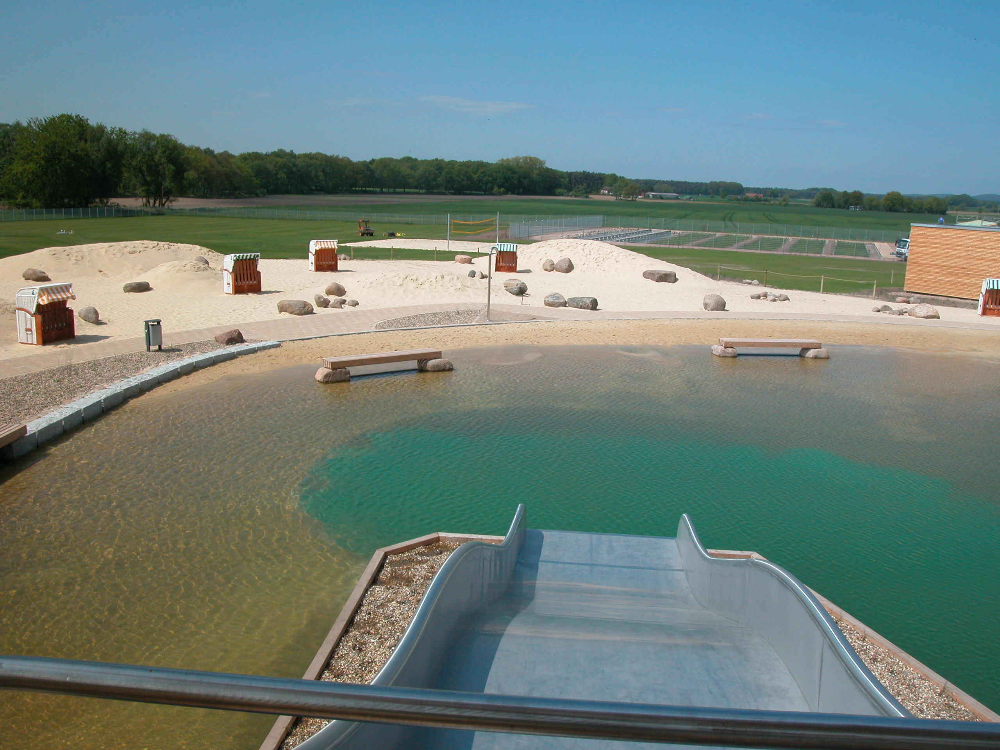
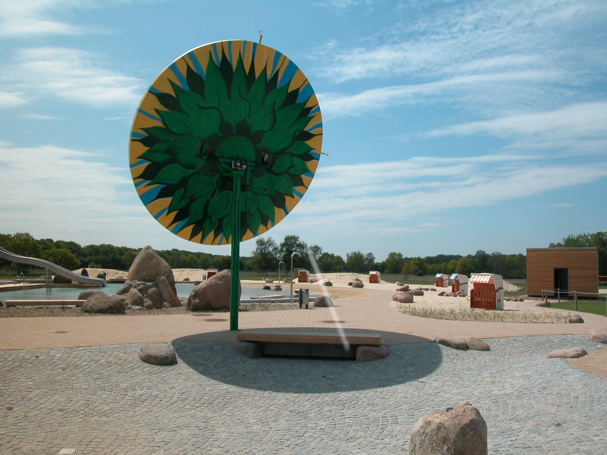
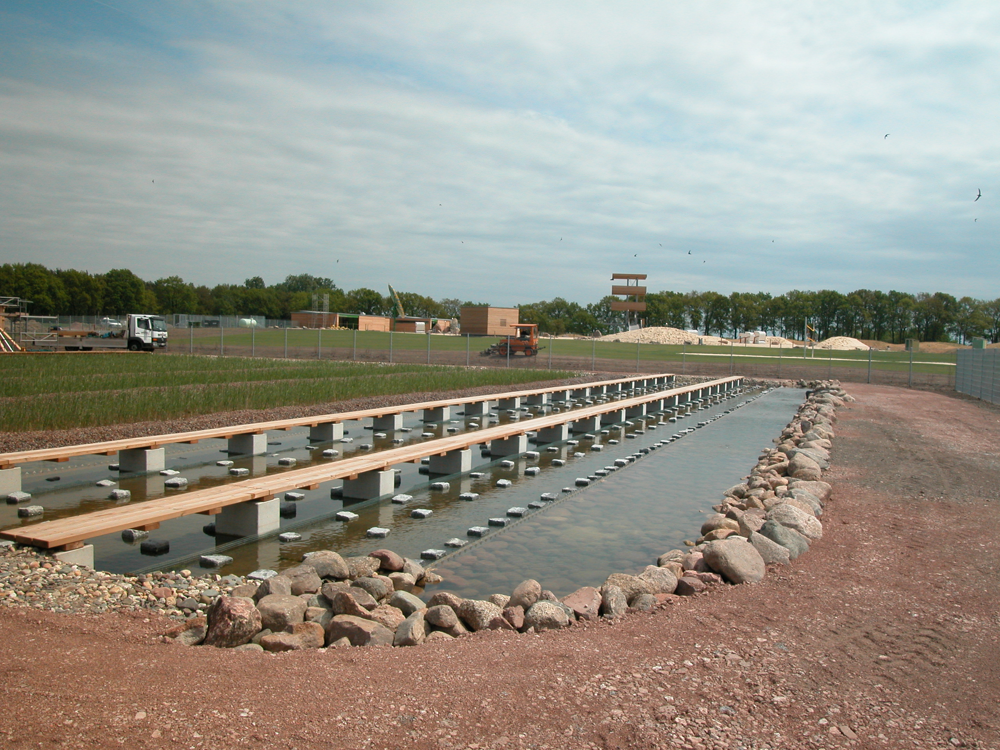

<Carousel>
<CarouselImage description="Hier sieht man den Pool">

</CarouselImage>
<CarouselImage description="Ah, noch ein tolles Bild">

</CarouselImage>
<CarouselImage>

</CarouselImage>
<CarouselImage>

</CarouselImage>
<CarouselImage>

</CarouselImage>
</Carousel>

<SpecificationsTable title="Naturbad Olfen – Technische Daten">
    {[
        ["Baujahr:", "2009/2010"],
        ["Planungszeitraum:", "2004 bis 2008"],
        ["Gesamtfläche:", "4,6 ha"],
        ["Bauweise:", "Neubau, 2-Kammer-System"],
        ["Badebecken:", "kombiniertes Nichtschwimmer-/ Schwimmerbecken mit integriertem Sprungbereich, separates Kinderbecken"],
        ["Wasseraufbereitung:", "vollbiologisch über technisches Feuchtgebiet (Constructed Wetland) mit horizontaler Durchströmung"],
        ["Ausstattung:", "fünf 25-m-Schwimmbahnen, Sprungturm mit 1/3-m-Plattform, 250 m² Holzstegen aus Lärchenholz, Massagestation, 1000 m² großer Sandstrand, Breitrutsche, Wasserspeier, Geysier, Schwalldusche im NS-Bereich, Badeinsel mit Zugang über Trittsteine, Kinderbecken mit Bachlauf, drei Sprudelsteinen, Sprühschlange und Kleinkindrutsche, Wasserspielplatz, Beachvolleyball."],
    ]}
</SpecificationsTable>