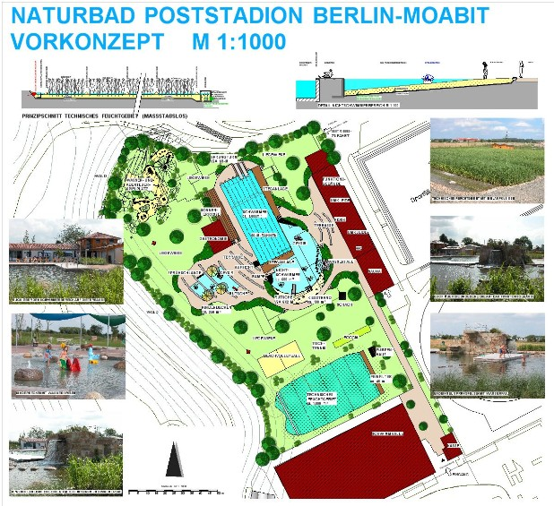

<SpecificationsTable title="Vorkonzept - technische Daten">
    {[
        ["Planungszeitraum", "2006"],
        ["Gesamtfläche:", "2,1 ha"],
        ["Bauweise:", "Umbau, 2-Kammer-System"],
        ["Badebecken:", "kombiniertes Nichtschwimmer-/ Schwimmerbecken mit integriertem Sprungbereich, separates Kinderbecken"],
        ["Nutzbare Wasserfläche:", "1.850 m²"],
        ["Wasseraufbereitung:", "vollbiologisch über techn. Feuchtgebiet (Constructed Wetland) mit horizontaler Durchströmung"],
        ["Ausstattung:", "acht 50-m-Schwimmbahnen, Sprungturm mit 1/3-m-Plattform, Holzstegen aus Lärchenholz, Kiesstrand, drei Sprudelsteine im NS-Bereich, Wasserfall,Rutsche, Geysir, Kinderbecken mit Bachlauf, Sprudelsteinen,Geysier Sprühschlange und Kleinkindrutsche, Wasser- und Abenteuerspielplatz, Boccia, Tischtennis, Beachvolleyball, Freischach."],
    ]}
</SpecificationsTable>
