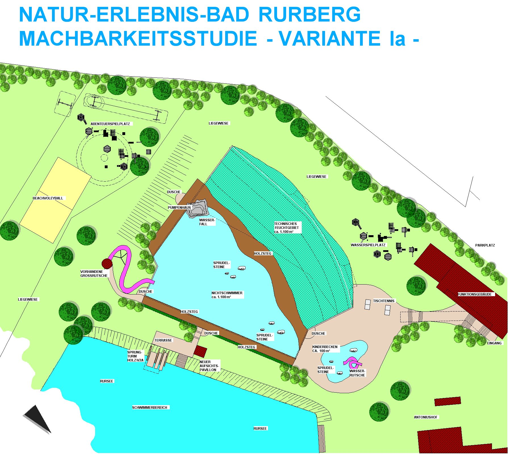
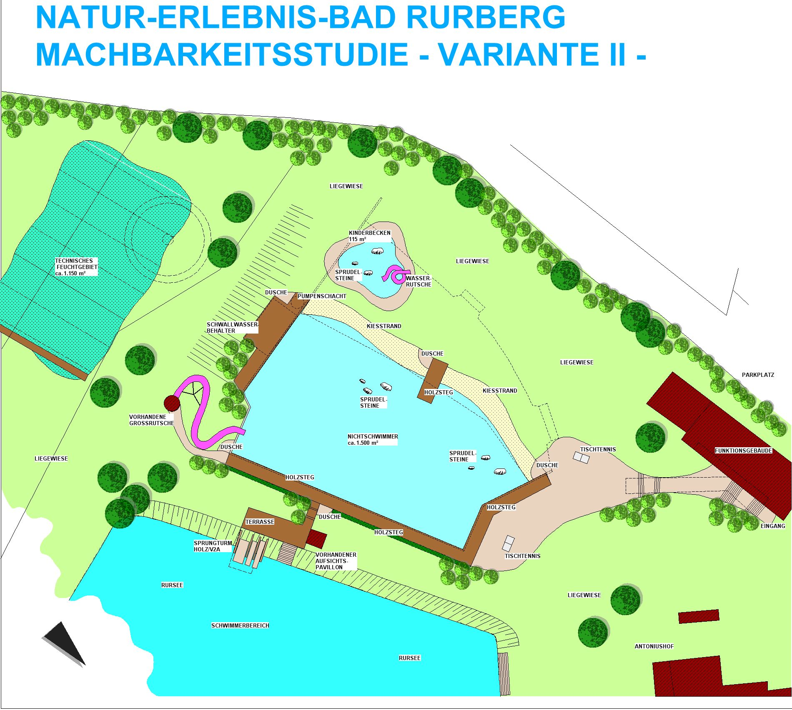
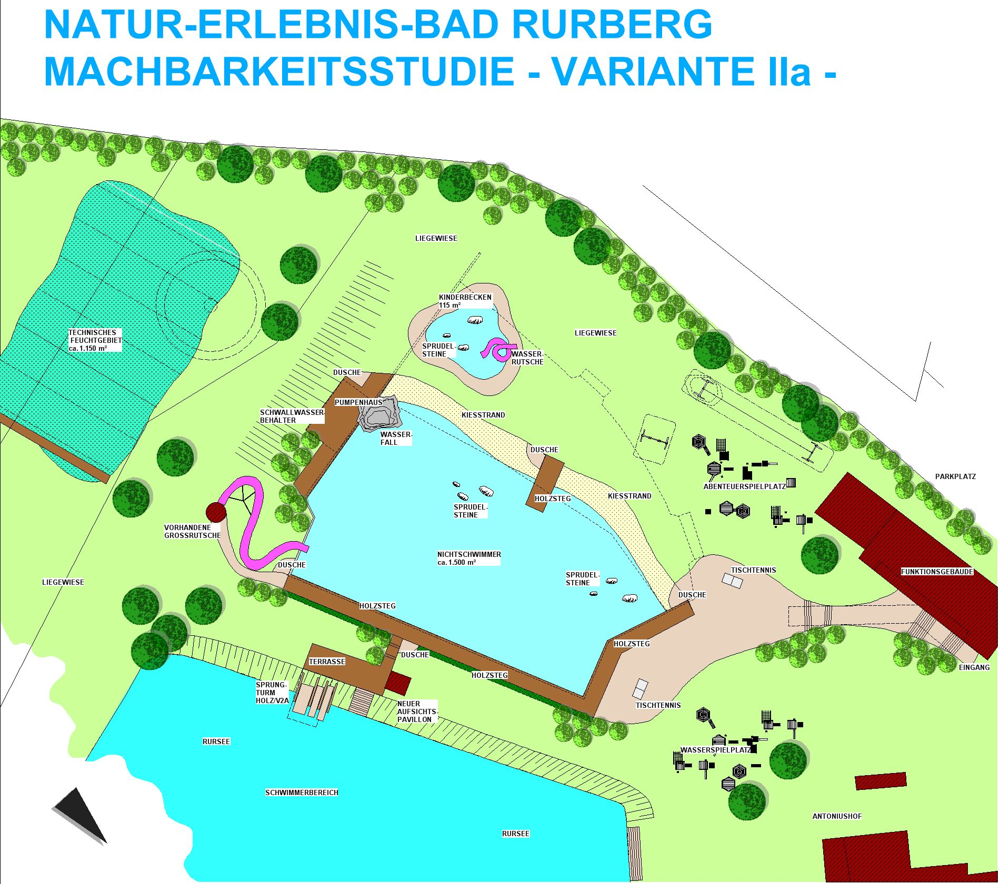

<SpecificationsTable title="Vorkonzept - technische Daten">
    {[
        ["Planungszeitraum:", "2002"],
        ["Gesamtfläche:", "3 ha"],
        ["Bauweise:", "Umbau, 2-Kammer-System"],
        ["Badebecken:", "Nichtschwimmerbecken, separates Kinderbecken, Schwimmerbereich im Rursee"],
        ["Nutzbare Wasserfläche:", "1.200 m²"],
        ["Wasseraufbereitung:", "vollbiologisch über techn. Feuchtgebiet (Constructed Wetland) mit horizontaler Durchströmung"],
        ["Ausstattung Variante I :", "Kiesstrand, Bekiesung Nichtschwimmerbereich, drei Sprudelsteine im NS-Bereich, Steganlagen um die Becken, Kinderbecken mit Rutsche und Quellsteinen, Sprungturm mit 1/3/5-m-Plattform"],
        ["Zusätzliche Ausstattung Variante Ia :", "Wasserfall, Wasserspielplatz, Abenteuerspielplatz, Beachvolleyballplatz, Aufsichtspavillon"]
    ]}
</SpecificationsTable>

## Machbarkeitsstudie Var I

## Machbarkeitsstudie Var Ia

## Machbarkeitsstudie Var II

## Machbarkeitsstudie Var IIa
