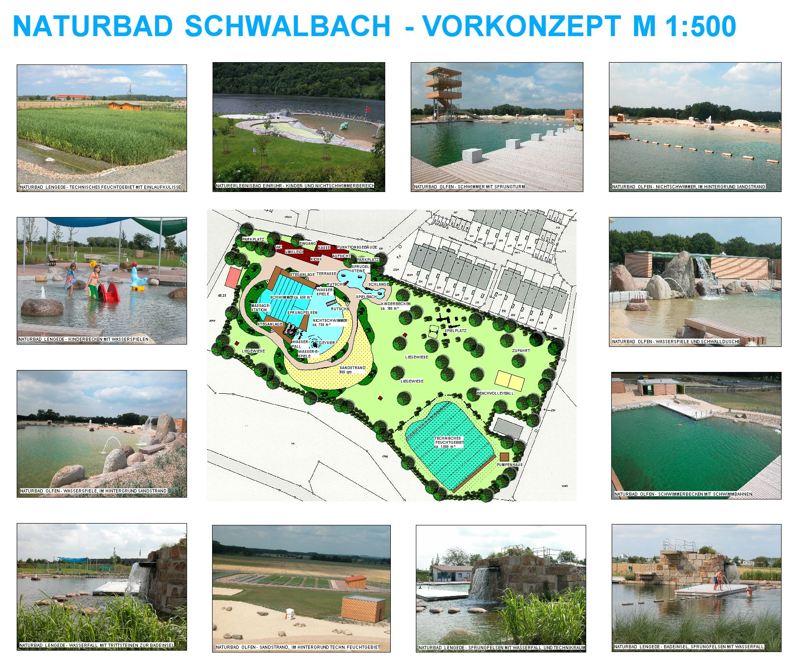

<SpecificationsTable title="Naturbad Schwalbach - technische Daten">
    {[
        ["Planungszeitraum:", "2010"],
        ["Gesamtfläche:", "1,7 ha"],
        ["Bauweise:", "Neubau, 2-Kammer-System"],
        ["Badebecken:", "kombiniertes Nichtschwimmer-/ Schwimmerbecken mit integriertem Sprungbereich, separates Kinderbecken"],
        ["Nutzbare Wasserfläche:", "1.580 m²"],
        ["Wasseraufbereitung:", "vollbiologisch über techn. Feuchtgebiet (Constructed Wetland) mit horizontaler Durchströmung"],
        ["Ausstattung:", "fünf 25-m-Schwimmbahnen, Sprungturm mit 1/3-m-Plattform, 250 m² Holzstegen aus Lärchenholz, Massagestation, 800 m² großer Sandstrand, Breitrutsche, Wasserspeier, Geysier, Schwalldusche im NS-Bereich, Badeinsel mit Zugang über Trittsteine, Kinderbecken mit Bachlauf, drei Sprudelsteinen, Sprühschlange und Kleinkindrutsche, Wasserspielplatz, Beachvolleyball."],
    ]}
</SpecificationsTable>
