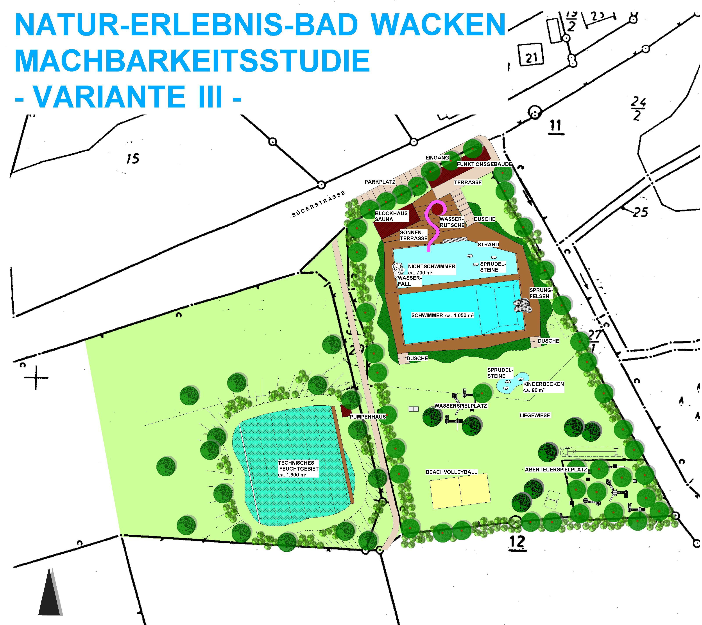

<SpecificationsTable title="Naturschwimmbad Wacken - Vorkonzept - technische Daten">
    {[
        ["Planungszeitraum:", "2002"],
        ["Gesamtfläche:", "1,2 ha"],
        ["Bauweise:", "Umbau, 2-Kammer-System"],
        ["Badebecken:", "Nichtschwimmer-, Schwimmerbecken mit integriertem Sprungbereich, separates Kinderbecken"],
        ["Nutzbare Wasserfläche:", "1.830 m²"],
        ["Wasseraufbereitung:", "vollbiologisch über techn. Feuchtgebiet (Constructed Wetland) mit horizontaler Durchströmung"],
        ["Ausstattung Variante I:", "50-m-Schwimmbahnen, 1/3-m-Sprungbrett, Bekiesung Nichtschwimmerbereich, drei Sprudelsteine im NS-Bereich, Kinderbecken mit Bachlauf, drei Sprudelsteine, Sprühschlange und Kleinkindrutsche"],
        ["Zusätzl. Ausstattung Var. II:", "Steganlage aus Lärchenholz, Sprungfelsen mit 1/3-m-Plattform, Abpflanzung, Erneuerungen der Duschen"],
        ["Zusätzl. Ausstattung Var. III:", "Wasserfall, Wasserrutsche, Blockhaussauna, Sonnenterrasse, Wasserspielplatz, Abenteuerspielplatz"],
    ]}
</SpecificationsTable>

## Machbarkeitsstudie Var 1

## Machbarkeitsstudie Var 2

## Machbarkeitsstudie Var 3
