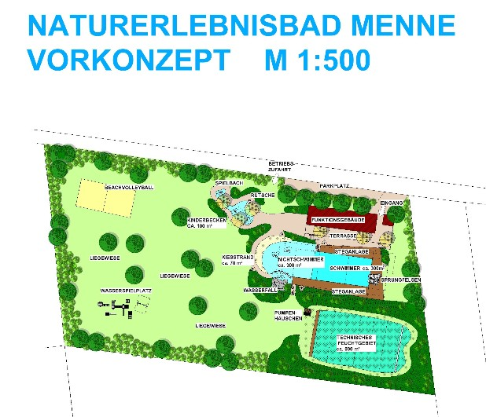

<SpecificationsTable title="Naturbad Warburg-Menne - Vorkonzept - technische Daten">
    {[
        ["Planungszeitraum:", "2005"],
        ["Bauweise:", "Umbau, 2-Kammer-System"],
        ["Badebecken:", "kombiniertes Nichtschwimmer-/ Schwimmerbecken mit integriertem Sprungbereich, separates Kinderbecken"],
        ["Nutzbare Wasserfläche:", "700 m²"],
        ["Wasseraufbereitung:", "vollbiologisch über techn. Feuchtgebiet (Constructed Wetland) mit horizontaler Durchströmung"],
        ["Ausstattung:", "Sprungfelsen mit 1/3-m-Plattform, Holzstegen aus Lärchenholz, Kiesstrand, Sprudelsteinen im NS-Bereich, Wasserfall, Kinderbecken mit Bachlauf, Sprudelsteinen und Kleinkindrutsche, Wasserspielplatz, Beachvolleyball."],
    ]}
</SpecificationsTable>
