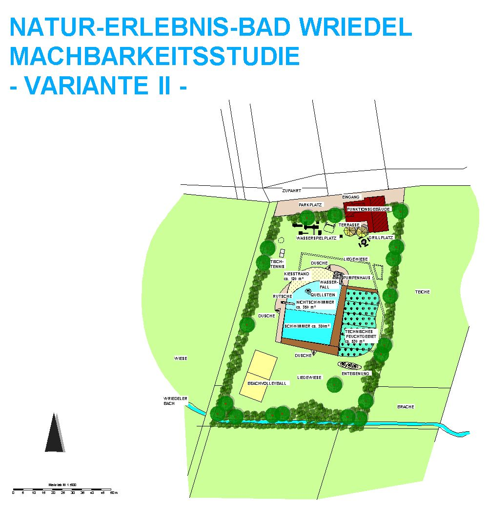

<SpecificationsTable title="Variante 1 - Technische Daten">
    {[
        ["Planungszeitraum:", "2003"],
        ["Gesamtfläche:", "0,8 ha"],
        ["Bauweise:", "Umbau, 2-Kammer-System"],
        ["Badebecken:", "Kombiniertes Nichtschwimmer-, Schwimmerbecken"],
        ["Nutzbare Wasserfläche:", "960 m²"],
        ["Wasseraufbereitung:", "vollbiologisch über techn. Feuchtgebiet (Constructed Wetland) mit horizontaler Durchströmung"],
        ["Ausstattung Var. I:", "Bekiesung Nichtschwimmerbereich, Steganlage aus Lärchenholz, Grillplatz, Enteisenungsanlage"]
    ]}
</SpecificationsTable>

<SpecificationsTable title="Variante 2 - Technische Daten">
    {[
        ["Planungszeitraum:", "2003"],
        ["Gesamtfläche:", "0,8 ha"],
        ["Bauweise:", "Umbau, 2-Kammer-System"],
        ["Badebecken:", "Kombiniertes Nichtschwimmer-, Schwimmerbecken"],
        ["Nutzbare Wasserfläche:", "730 m²"],
        ["Wasseraufbereitung:", "vollbiologisch über techn. Feuchtgebiet (Constructed Wetland) mit horizontaler Durchströmung"],
        ["Ausstattung Var. I:", "Bekiesung Nichtschwimmerbereich, Steganlage aus Lärchenholz, Quellstein im Nichtschwimmerbereich, Wasserfall, Kiesstrand Grillplatz, Enteisenungsanlage"]
    ]}
</SpecificationsTable>

