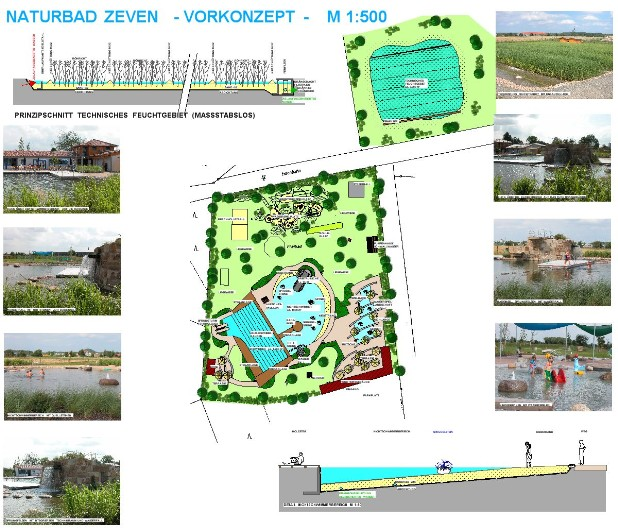

<SpecificationsTable title="Vorkonzept - technische Daten">
    {[
        ["Planungszeitraum:", "2005"],
        ["Bauweise:", "Umbau, 2-Kammer-System"],
        ["Badebecken:", "Nichtschwimmerbecken, Schwimmerbecken mit integriertem Sprungbereich, separates Kinderbecken"],
        ["Nutzbare Wasserfläche:", "3.550 m²"],
        ["Wasseraufbereitung:", "vollbiologisch über techn. Feuchtgebiet (Constructed Wetland) mit horizontaler Durchströmung"],
        ["Ausstattung:", "acht 50-m-Schwimmbahnen, Sprungturm mit 1/3-m-Plattform, Holzstegen aus Lärchenholz, Kiesstrand, drei Sprudelsteine im NS-Bereich, Wasserfall, Geysir, Badeinsel, Breitrutsche, Kinderbecken mit Bachlauf, Sprudelsteinen, Geysier, Wasserspielen und Kleinkindrutsche, Wasser- und Abenteuerspielplatz, Boccia,Tischtennis, Beachvolleyball, Frei-Schach."],
    ]}
</SpecificationsTable>
