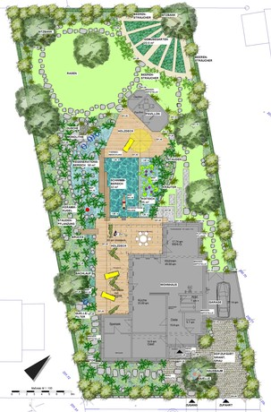

<SpecificationsTable title="Schwimmteich in Kassel-Harleshausen - technische Daten">
    {[
        ["Planungszeitraum:", "2009/2010"],
        ["Bauweise:", "Neubau, 2-Kammer-System"],
        ["Badebecken:", "Schwimmerbecken, separater Koiteich"],
        ["Nutzbare Wasserfläche:", "32 m²"],
        ["Wasseraufbereitung:", "vollbiologisch über techn. Feuchtgebiet (Constructed Wetland) mit horizontaler Durchströmung"],
        ["Ausstattung:", "Gegenstromanlage mit Sprungblock, Badeleiter, Unterwasserbeleuchtung, Holzstege aus Lärchenholz, Sandstrand, Sprudelkugel, Wasserfall, Bachlauf mit Quelle und Brücke, Dusche"],
    ]}
</SpecificationsTable>
