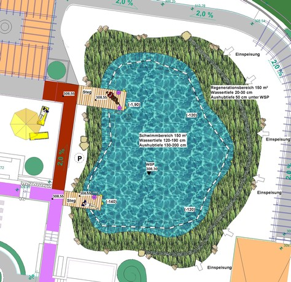

<SpecificationsTable title="Saunateich Tournesol-Allwetterbad in Idstein - technische Daten">
    {[
        ["Baujahr:", "2009/2010"],
        ["Planungszeitraum:", "2009"],
        ["Bauweise:", "Neubau, 1-Kammer-System"],
        ["Badebecken:", "Saunateich"],
        ["Nutzbare Wasserfläche:", "150 m²"],
        ["Wasseraufbereitung:", "vollbiologisch über techn. Feuchtgebiet (Constructed Wetland) mit horizontaler Durchströmung"],
        ["Ausstattung:", "Holzstege aus Lärchenholz, Schwimmbadleitern, Beleuchtung"],
    ]}
</SpecificationsTable>
