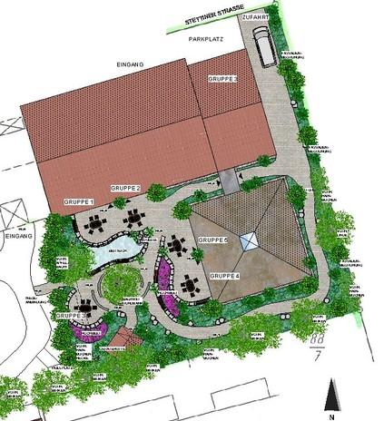
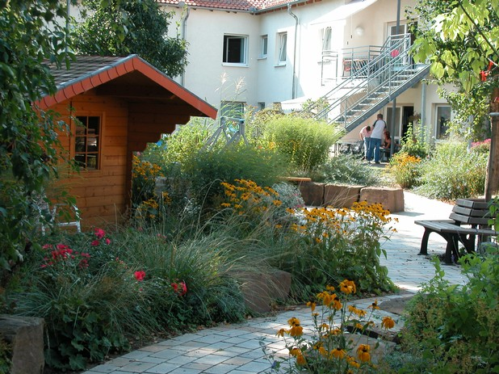
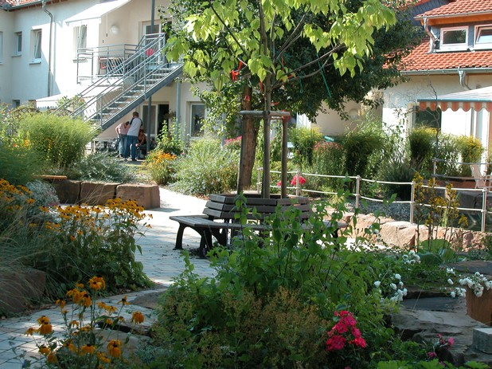
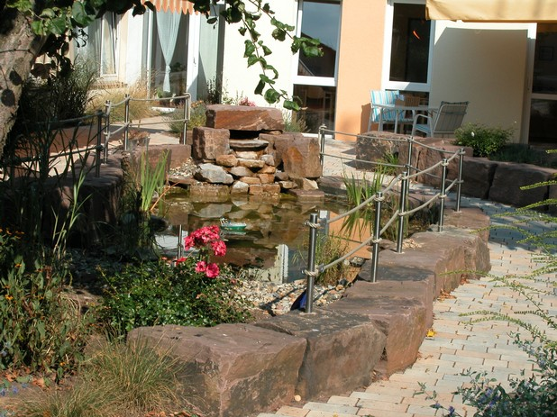
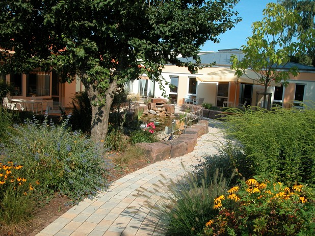
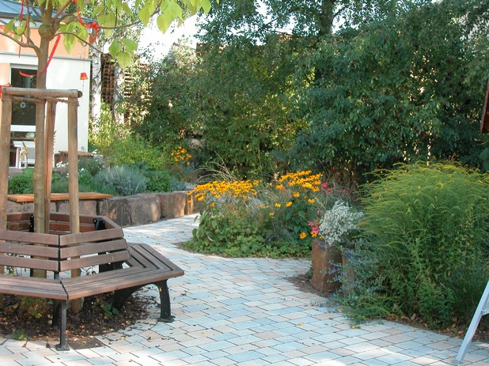
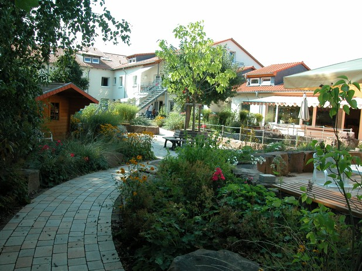
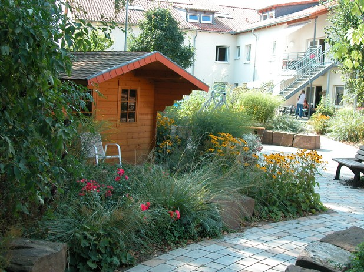
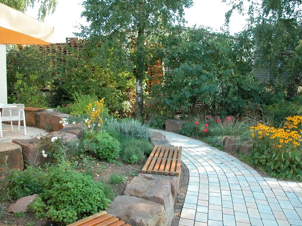

<Carousel>
<CarouselImage description="Entwurf">

</CarouselImage>
<CarouselImage description="Blick in die Wohnanlage">

</CarouselImage>
<CarouselImage description="Zentraler Sitzplatz">

</CarouselImage>
<CarouselImage description="Teich mit Quelle">

</CarouselImage>
<CarouselImage description="Innenhof mit Gruppensitzplätzen">

</CarouselImage>
<CarouselImage description="Herbststimmung">

</CarouselImage>
<CarouselImage description="Sitzplatz in der Mitte">

</CarouselImage>
<CarouselImage description="Herbstaspekt">

</CarouselImage>
<CarouselImage description="Natursteinmauern mit Sitzflächen">

</CarouselImage>
</Carousel>

<SpecificationsTable title="Technische Daten">
    {[
        ["Baujahr", "2007"],
        ["Planungszeitraum", "2006 bis 2007"],
        ["Ausstattung:", "Sitzplätze für fünf Gruppen, barrierefreie Gestaltung mit Naturstein-Sitzmauern, zentraler Sitzplatz, Zierteich mit Quellbach, Hochbeete, abwechslungsreiche Bepflanzung mit Stauden der verschiedenen Lebensbereiche, Kräuterbeete"],
    ]}
</SpecificationsTable>
