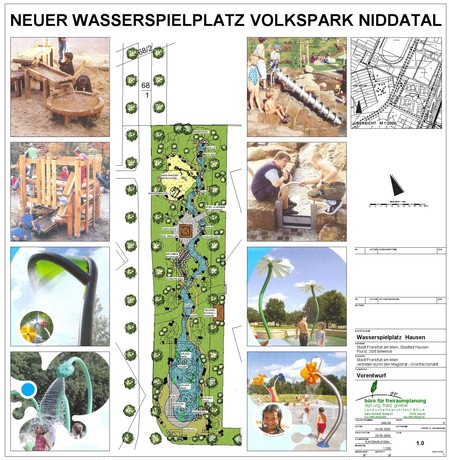
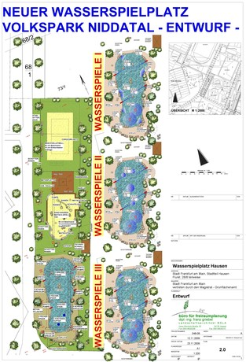

<Carousel>
<CarouselImage description="Vorentwurf">

</CarouselImage>
<CarouselImage description="Entwurf Standort 1">

</CarouselImage>
</Carousel>

<SpecificationsTable title="Wasserspielplatz Frankfurt/Main - technische Daten">
    {[
        ["Baujahr:", "2010/2011"],
        ["Planungszeitraum:", "2008 bis 2010"],
        ["Gesamtfläche:", "3.800 m²"],
        ["Bauweise:", "Wasserspielplatz mit Sprühfeld und Sand-Wasser-Matschbereich"],
        ["Ausstattung:", "Sprühfeld mit Wasserfall, Hüpfpollern, Spritzkanonen, Geysier und Sprühsteinen, Sand-Wasser-Matsch-Bereich mit Handpumpe und Matschrinnen/-tischen aus V2A, Gestaltung des Umfeldes mit Solitärbäumen und -sträuchern, Granitfindlingen, Rollrasen"],
    ]}
</SpecificationsTable>
