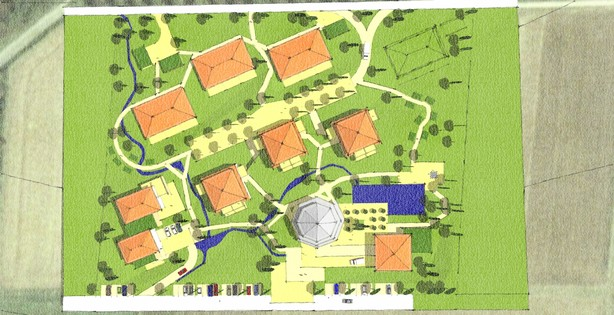
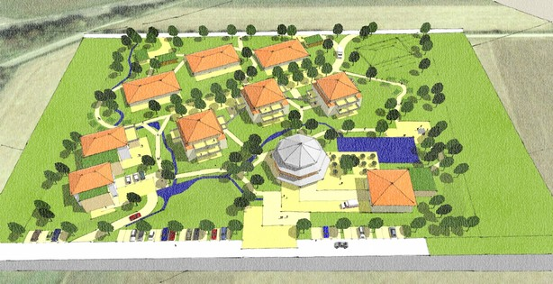
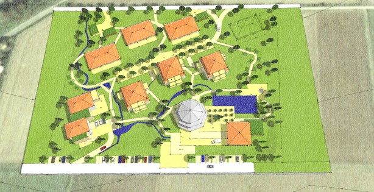

<Carousel>
<CarouselImage description="Grundriss Vorkonzept">

</CarouselImage>
<CarouselImage description="Aufsicht Vorkonzept">

</CarouselImage>
<CarouselImage description="Aufsicht Vorkonzept">

</CarouselImage>
</Carousel>

<SpecificationsTable title="Wohnanlage Ahnatal - technische Daten">
    {[
        ["Planungszeitraum:", "2010"],
        ["Bauweise:", "Integrative Wohnanlage für betreutes Pflegewohnen für behinderte und ältere Menschen"],
        ["Ausstattung:", "barrierefreie Anlage mit Zierteich, Wasserlauf, Terrasse am Teich, Sitzplätzen, Bouleplatz, Hochbeete zum Gärtnern, Ruhe- und Sitzmöglichkeiten im Park, Freischach, Werken und Basteln im Freien"],
    ]}
</SpecificationsTable>
