<Carousel>
<CarouselImage description="Entwurf">

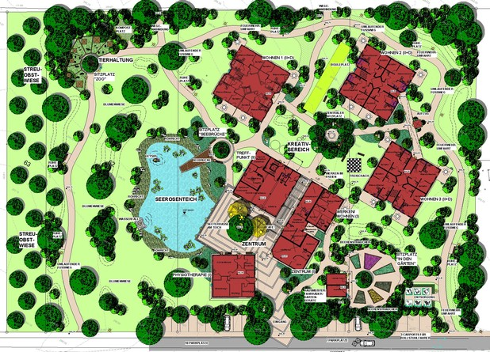

</CarouselImage>
<CarouselImage description="Seebrücke">

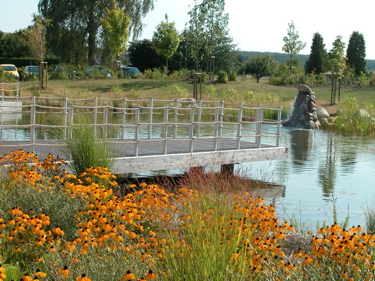

</CarouselImage>
<CarouselImage description="Teich mit Seeterrasse">

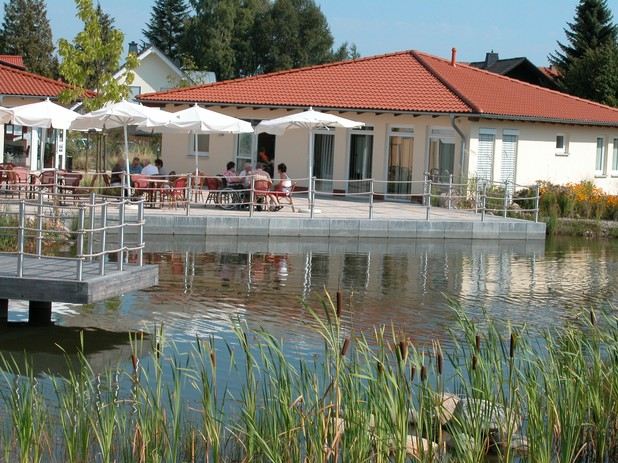

</CarouselImage>
<CarouselImage description="Wasserfall">

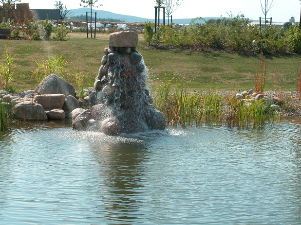

</CarouselImage>
<CarouselImage description="Terrasse mit Teich">

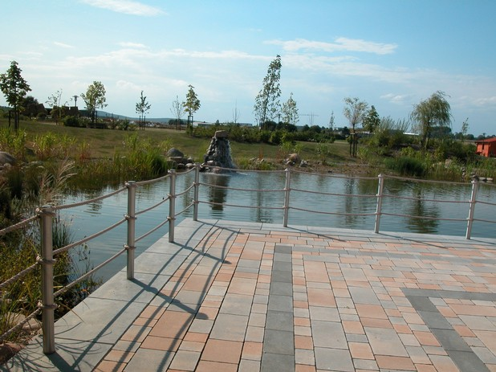

</CarouselImage>
<CarouselImage description="Herbststimmung am Teich">

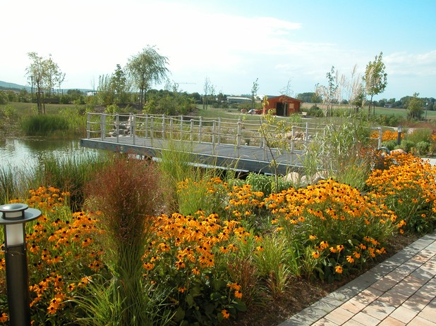

</CarouselImage>
<CarouselImage description="Gärten für die Bewohner mit Hochbeeten">

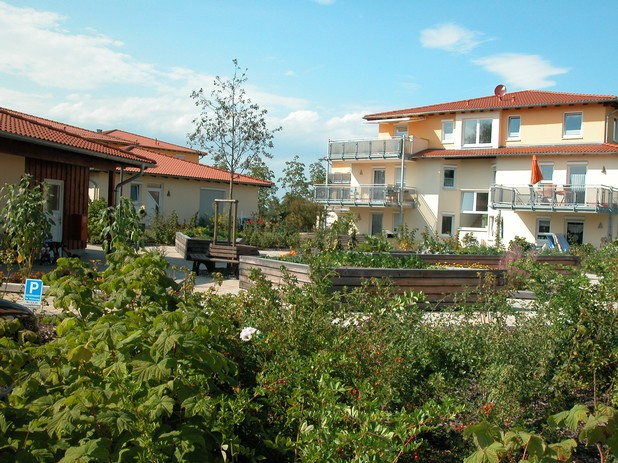

</CarouselImage>
<CarouselImage description="Seebrücke mit Ausblick in die Landschaft">

</CarouselImage>
<CarouselImage description="Zierteich mit Steg und Wasserfall">

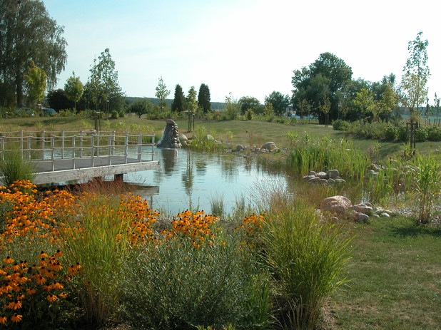

</CarouselImage>
<CarouselImage description="Herbststimmung an der Terrasse">

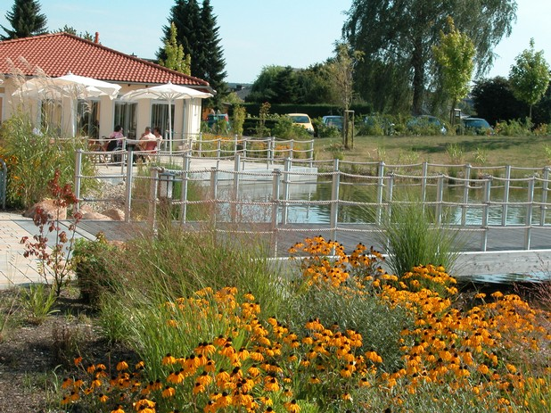

</CarouselImage>
<CarouselImage description="Wasserfall">

</CarouselImage>
<CarouselImage description="Zierteich mit Steg und Wasserfall">

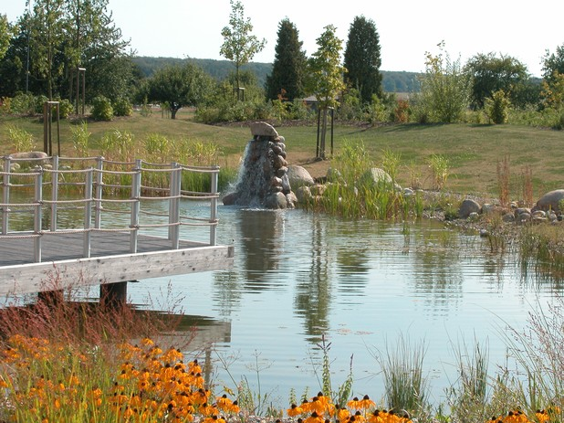

</CarouselImage>
<CarouselImage description="Teich mit Wohngebäuden">

</CarouselImage>
<CarouselImage description="Sitzplatz im Innenhof">

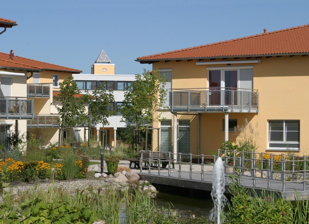

</CarouselImage>
<CarouselImage description="Seeterrasse">

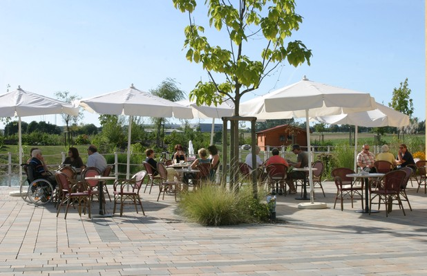

</CarouselImage>
<CarouselImage description="Blick über den Teich">

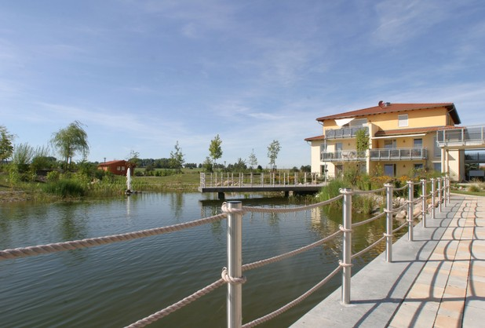

</CarouselImage>
</Carousel>

<SpecificationsTable title="Wohnanlage Calden - technische Daten">
    {[
        ["Baujahr:", "2007/2008"],
        ["Planungszeitraum:", "2005 bis 2007"],
        ["Gesamtfläche:", "1,2 ha"],
        ["Bauweise:", "Integrative Wohnanlage für betreutes Pflegewohnen"],
        ["Ausstattung:", "barrierefreie Anlage mit Zierteich mit Wasserfall und Geysier, Terrasse am Teich, Sitzplatz mit &quot;Seebrücke&quot;, Tierhaltung, Bouleplatz, Hochbeete zum Gärtnern, Ruhe- und Sitzmöglichkeiten im Park, Freischach, Werken und Basteln im Freien, Blumenwiese, Obstwiese"],
    ]}
</SpecificationsTable>
