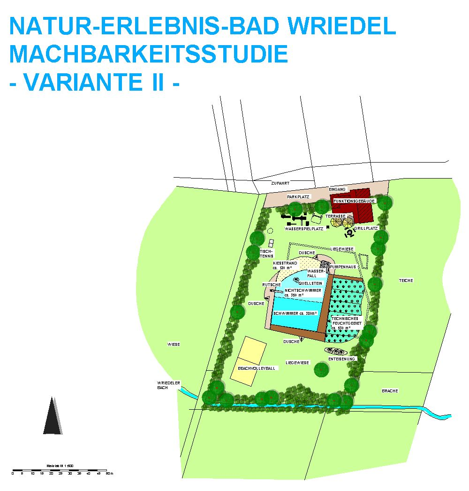

## Variante 1

## Variante 2

### Änderungen in Variante 2

|                       |                                                                                                                                                         |
| --------------------- | ------------------------------------------------------------------------------------------------------------------------------------------------------- |
| Nutzbare Wasserfläche | 730 m²                                                                                                                                                  |
| Wasseraufbereitung    | vollbiologisch über techn. Feuchtgebiet (Constructed Wetland) mit horizontaler Durchströmung                                                            |
| Ausstattung Var. II:  | Bekiesung Nichtschwimmerbereich, Steganlage aus Lärchenholz, Quellstein im Nichtschwimmerbereich, Wasserfall, Kiesstrand Grillplatz, Enteisenungsanlage |