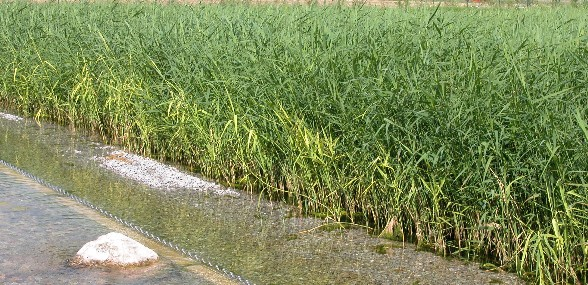

# Öffentliche Naturbäder

## Zur Situation
Das **konventionelle Schwimmbad** mit Heizung und chemischer Wasseraufbereitung (Chlor, Ozon) stellte seit den 60iger Jahren ein flächendeckend vorhandenes, gut besuchtes Freizeitangebot dar und ermöglichte den Bürgern, bei entsprechendem Wetter täglich baden zu gehen.

Da sich die hygienischen Anforderungen sowie die Ansprüche und das Freizeitverhalten in den letzten 30 Jahren maßgeblich geändert haben, sind Badeanstalten "nur" mit Schwimmangebot **nicht mehr zeitgemäß**. Heute geht der Trend zu teueren überregionalen Spaßbädern mit vielfältigen Freizeitangeboten, die sich jedoch nur in zentraler Lage mit ausreichendem Einzugsgebiet verwirklichen lassen.

Die verbleibenden regionalen, konventionellen Freibäder in den ländlich strukturierten Gemeinden sind veraltet, haben **hohe Unterhaltungskosten** sowie einen großen **Investitionsstau**, so dass die Kommunen vor großen finanziellen Problemen stehen.

Viele Schwimmbäder wurden deshalb schon geschlossen und die Bürger müssen auf die verbleibenden Bäder der nahenliegenden Zentren ausweichen, was nicht nur aus Kostengründen ein regelmäßiges Baden für Familien, Kinder und Jugendliche unmöglich macht.

Ein weiterer Aspekt sind die geringen Einnahmen, da sich die jährliche **Nutzungsdauer** auf wenige Wochen beschränkt. Für den Rest des Jahres ist das Gelände in der Regel abgesperrt und der Nutzung durch die Bürger entzogen. Die Unterhaltung und Pflege der Anlage verursacht jedoch nahezu ganzjährig Kosten. Die Gemeinden sind jedoch zu einem dramatischen Sparkurs gezwungen und suchen nach Einsparpotenzial. Oft geht das zu Lasten des Freizeitangebots. Besonders wenn das konventionelle Freibad in die Jahre gekommen ist und die Sanierungskosten die finanziellen Möglichkeiten der Gemeinde übersteigen.

Die **Umgestaltung** in ein Naturschwimmbad mit biologischer Wasseraufbereitung ist die **Lösung**. Oft konnten Gemeinden durch die Umwandlung herkömmlicher Freibäder in Naturbäder die **Unterhaltungskosten deutlich senken** und den Betrieb sichern.

Naturbäder haben sich bereits in vielen Städten und Gemeinden Deutschlands bewährt (über 100 Kommunalanlagen allein in unserem Bundesgebiet). Die hohe Akzeptanz der natürlich wirkenden Wasserflächen wird durch die hohen Besucherzahlen eindrucksvoll belegt.

**Ein Naturschwimmbad ist eine ökonomisch wie ökologisch sinnvolle Investition in die Zukunft.**

## Das Naturschwimmbad
... ist ein geschlossenes **limnisches System**, das auch ohne häufigen Wasseraustausch und **ohne Chemikalien** mit einem übertechnischen Aufwand das Badewasser hygienisch einwandfrei hält.

Grundsätzlich wird bei der Anlage eines Naturschwimmbades eine möglichst große Wasserfläche bzw. Wasservolumen geschaffen. Diese wird in **nutzbare Wasserfläche** (Schwimmteich) und **Regenerationsbereich** (Kiesfilter, Röhrichtzone = technisches Feuchtgebiet) unterteilt.

Das vorhandene Schwimmbecken kann häufig ganz oder teilweise als Schwimmbereich erhalten werden und dient gleichzeitig noch als Fundament für Holzsteganlagen an den Beckenrändern.

Der naturnah gestaltete **Regenerationsbereich** mit Kies/Sandfilter und Röhricht gewährleistet die Reinigung des im Kreislauf gepumpten Badewassers.

Durch ausgedehnte Flachwasserzonen kommt es zu einer **schnellen Wassererwärmung**. Dadurch kann die Badenutzung des Naturschwimmbades gegenüber einem herkömmlichen unbeheizten Freibad in der Regel zeitlich ausgedehnt werden.

Auch auf der Kostenseite stellt der Bau eines Naturschwimmbades eine vergleichsweise günstige Alternative zum konventionellen Schwimmbad dar und zwar sowohl hinsichtlich der Bau- als auch der Unterhaltungskosten.

Die **Nutzungsdauer** eines Naturschwimmbades erstreckt sich bei einem natürlich gestalteten und vielfach nutzbarem Freizeitangebot (z.B. Naturspielplatz, Beachvolleyball, Eislauffläche und Erholungsnutzung der Parkanlage) ggf. **über das ganze Jahr**.

## Vorteile
- Geringerer finanzieller Aufwand im Vergleich zur konventionellen Sanierung
- Neue Badegäste werden angesprochen, da ein Naturschwimmbad eine attraktive Alternative zu den konventionellen Bädern in der Umgebung darstellt
- Der Einsatz von Chemie entfällt, dadurch ist das Bad für empfindliche Menschen gegenüber Chemikalien zum Baden attraktiv
- Zur Minimierung der Baukosten werden die vorhandenen Strukturen des Schwimmer- und des Nichtschwimmerbereiches soweit möglich beibehalten
- Höhere Attraktivität, interessantere und vielfältige Spielmöglichkeiten
- Ökologische Aufwertung der Gesamtanlage, ansprechende naturnahe Gestaltung und dadurch ganzjährige Erholungsfunktion
- Verlängerung der Badesaison durch schnellere Erwärmung des Wassers
- Die Verbrauchskosten wie Wasser- und Strom sind deutlich niedriger als in herkömmlichen, da die Wasseraufbereitung im geschlossenen Kreislauf läuft und die Umwälzvolumen wesentlich geringer sind
- Möglichkeiten der Erbringung von Eigenleistungen zur Minimierung der Baukosten sowie der Betriebskosten

## Wasseraufbereitung

#### Philosophie
Grundgedanke bei der Entwicklung des technischen Feuchtgebietes ist, die in natürlichen Gewässern vorhandenen Randbereiche wie Röhrichtzonen, die für eine biologische Wasserreinigung sorgen, auszulagern und für die Hygienisierung, Nährstoffbindung und Filterung des Badewassers zu optimieren. Dabei ist das System nicht den Verfahren der Abwasserreinigung (wie z. B. Kies-Boden-Filter) entlehnt, wo es sich um die Klärung relativ geringer Volumina mit hoher Verschmutzung handelt. Vielmehr haben wir es bei einem Naturschwimmbad mit großen Volumenströmen mit geringer Verschmutzung zu tun. Deshalb ist es naheliegend, ein Verfahren einzusetzen, wie das Schilfbeet, das in der Lage ist, große Mengen gering belasteten Wassers zu schönen. Dieses Prinzip wurde hydraulisch optimiert und so zum "Technischen Feuchtgebiet" [FG] weiterentwickelt.

#### Aufbau, Funktion
Das technische Feuchtgebiet (constructed wetland) ist ein mit Röhrichtvegetation bestockter Sand-Schilf-Filter. Dieses vollbiologische Reinigungssystem ist als hydraulisch optimiertes, horizontal durchströmtes Schilfbeet konzipiert. Das Röhricht übernimmt durch sein Trieb- und Wurzelwachstum die Reinigungsleistung und die Nährstoffelimination und dient als Grundlage für das Wachstum von Mikroorganismen.

#### Hygienisierung
Die biologische Reinigungsleistung im technischen Feuchtgebiet [FG] erfolgt durch Mikroorganismen und Kleinstlebewesen in Verbindung mit den Röhricht(Repositionspflanzen), hierdurch wird eine natürliche Hygiedes Badewassers erreicht. Außerdem findet hier durch das Einwirken von natürlicher UV-Strahlung eine Entkeimung statt (wichtig bei der Eliminierung von Viren!).

####  Nährstoffbindung
Um eine weitergehende Reinigung des Badewassers zu erreichen, ist das technische Feuchtgebiet in mehrere Bereiche mit verschiedenen Substraund Zusatzstoffen (Kationentauscher, Katalysatoren) unterteilt. Dadurch wird die Nährstoffbindung und Nährstofffestlegung erhöht. Nährstoffe werden von den ausgedehnten Röhrichtbeständen aufgenommen, überüssige Nährstoffe werden gebunden und festgelegt.

#### Feinfilter
Der dem technischen Feuchtgebiet angegliederte leistungsfähige Flächenfeinfilter generiert hygienisch einwandfreies und glasklares Badewasser. In dem Feinfilter wird als Filtermedium ein Spezial-Filtervlies eingesetzt, das lediglich zwei bis dreimal pro Saison ausgetauscht werden muss.

#### Bemessung, Kosten
Das Verhältnis zwischen Nutzfläche (Badebereiche) und Filterfläche beträgt in der Regel ca. 1 : 1. Die Bruttobaukosten für das Technische Feuchtgebiet [FG] belaufen sich einschließlich des integrierten Flächenfeinfilters im Mittel auf ca. 100 € je m².

#### Vorteilegegenüber bodengebundenen Reinigungssystemen
Durch die jederzeit gewährleistete optimale Sauerstoffversorgung werden an das Substrat gebundene Nährstoffe auch bei abgeschaltetem Wasserkreislauf nicht wieder rückgelöst – und dies bei einfachster Umwälztechnik. Durch die ausgedehnte flache Wasserfläche des technischen Feuchtgebietes erfolgt eine rasche Erwärmung des Badewassers und somit eine verlängerte Badesaison. Das System zeichnet sich durch geringe Baukosten, einfache und somit wartungsarme und wenig störanfällige Umwälztechnik und geringen Pflegeaufwand aus.

